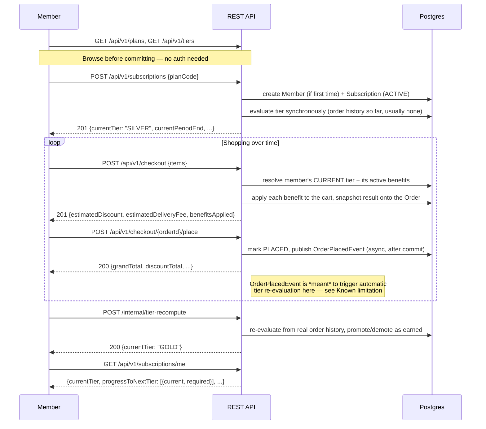
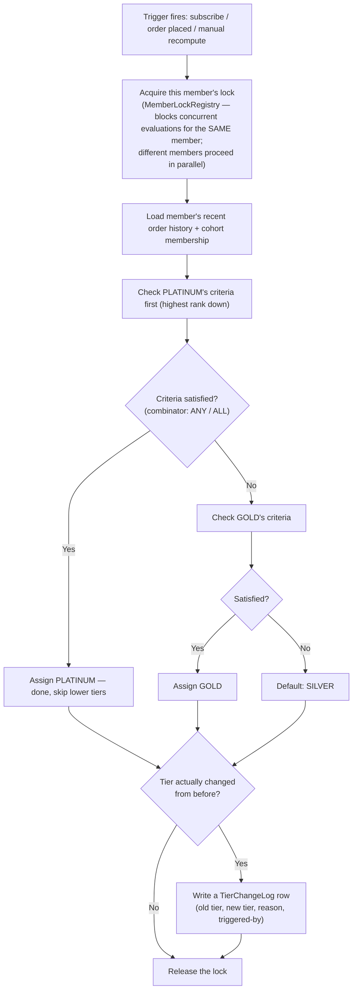
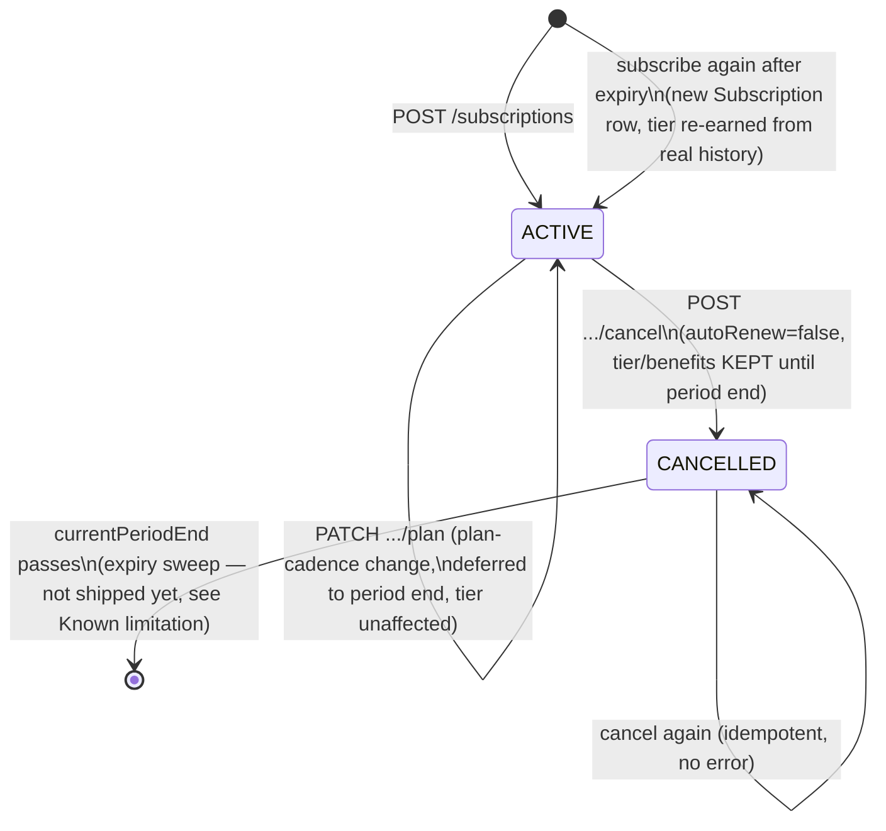
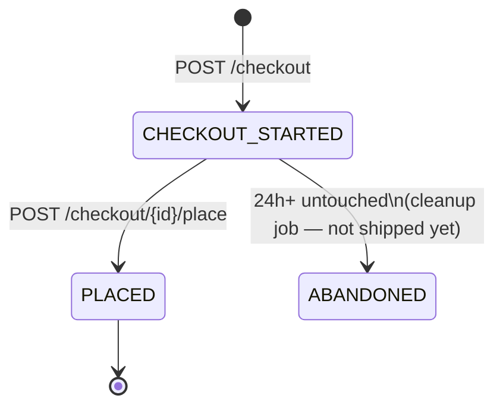

# Product Workflow

How the Membership Program actually works, end to end — the member journey, tier progression,
benefit resolution, and checkout. For "how the app was built," see [README.md](README.md); for
setup instructions, see [SETUP.md](SETUP.md); for exact request/response shapes, see
[`docs/prd/06-api-contracts.md`](docs/prd/06-api-contracts.md) and
[`docs/lld/05-api-layer.md`](docs/lld/05-api-layer.md).

> **Note on current behavior**: this document describes the system **as designed**. One step —
> automatic tier promotion when a real order is placed — currently has a known bug (see
> [Known limitation](#known-limitation-in-the-current-build) below) and does not fire live. The
> manual recompute endpoint is the reliable path today. Everything else described here is verified
> working against the live app.

---

## Core concepts

| Concept | What it is |
|---|---|
| **Plan** | A billing cadence a member subscribes to — `MONTHLY` (₹299) or `YEARLY` (₹2499). Controls billing period only, not perks. |
| **Tier** | `SILVER` → `GOLD` → `PLATINUM`, ranked ascending. **Earned, not chosen** — a member never picks their tier; it's computed from their behavior. |
| **Tier criteria** | The rule(s) that earn a tier. Today: `ORDER_COUNT_MIN` (N orders within a rolling window — GOLD needs 5 orders/30 days, PLATINUM needs 15/30 days). Combined via a `combinator` (`ANY`/`ALL`) if a tier has more than one criterion. |
| **Benefit** | A perk a tier unlocks — `FREE_DELIVERY` (waives delivery fee above a min order value) or `PERCENTAGE_DISCOUNT` (% off, optionally capped, optionally restricted to a product category). |
| **Subscription** | The record linking a Member to a Plan, with a status (`ACTIVE`/`CANCELLED`) and a billing period. Tier lives independently on the member, not embedded in the subscription. |
| **Order / Checkout** | A simulated cart-to-purchase flow used to demonstrate benefits applying in practice. |

---

## The member journey



**Key design point**: a member never tells the system what tier they want. `progressToNextTier`
in the current-membership response exists precisely so a member can see how close they are
(e.g. `"current": "3", "required": "5"`) without being able to set it directly.

---

## How a tier gets computed

Every tier evaluation — whether triggered by subscribing, placing an order, or the manual
recompute endpoint — runs the same algorithm, serialized per member so concurrent triggers can't
race each other into an inconsistent state:



A member with enough orders to qualify for PLATINUM directly (skipping GOLD) lands on PLATINUM in
one step — tiers are evaluated highest-first, not incrementally walked up one rank at a time.

---

## How a benefit gets applied at checkout

The most important design decision in this flow: **benefits are locked in the moment checkout
starts**, not recomputed at the moment the order is placed. This means an admin changing a
discount percentage, or the member's tier changing, between "start checkout" and "place order"
never retroactively affects an order already in flight.

```mermaid
flowchart LR
    Start["POST /checkout {items}"] --> Resolve["Resolve member's CURRENT tier<br/>(no membership → no tier)"]
    Resolve --> HasTier{Has an active<br/>membership right now?}
    HasTier -->|No| Empty["No benefits — standard delivery fee, no discount"]
    HasTier -->|Yes| LoadB["Load that tier's active benefits<br/>(FREE_DELIVERY, PERCENTAGE_DISCOUNT)"]
    LoadB --> ApplyEach["Run each benefit's policy against the cart"]
    ApplyEach --> Snapshot["Freeze the result onto Order.benefitSnapshotJson<br/>— this is now permanent for this order"]
    Empty --> Resp1["201 CHECKOUT_STARTED<br/>{estimatedDiscount, estimatedDeliveryFee, benefitsApplied}"]
    Snapshot --> Resp1
    Resp1 --> Place["POST /checkout/{orderId}/place"]
    Place --> UseSnapshot["Read the FROZEN snapshot —<br/>never re-resolves tier/benefits at this point"]
    UseSnapshot --> Grand["Compute grandTotal from the snapshot, mark PLACED"]
```



**Example** (verified live against a `GOLD` member — 10% discount, free delivery):

```
POST /checkout   {items: [{unitPrice: 1000, quantity: 1, ...}]}
→ 201 {subtotal: 1000.00, estimatedDiscount: 100.00, estimatedDeliveryFee: 0, benefitsApplied: ["PERCENTAGE_DISCOUNT","FREE_DELIVERY"]}

POST /checkout/{id}/place
→ 200 {subtotal: 1000.00, discountTotal: 100.00, deliveryFee: 0.00, grandTotal: 900.00}
```

---

## Subscription lifecycle



A cancelled member keeps their tier and every benefit until `currentPeriodEnd` — cancelling stops
future renewal, it doesn't revoke what's already been paid for.

---

## Order (checkout) lifecycle



Placing the same order twice is rejected (`409 ORDER_NOT_IN_CHECKOUT_STATE`) — `PLACED` is a
one-way transition.

---

## What's not in this workflow yet

The design covers more than what's live today. Not shipped, and so not part of the workflow above:
admin APIs to create/edit plans, tiers, or benefits at runtime (Day-1 ships with seeded data only);
a `COHORT_MEMBERSHIP` tier criterion; `EXCLUSIVE_DEALS_ACCESS`/`PRIORITY_SUPPORT` benefits; an
auto-renewal job and payment-failure grace period; the nightly tier-reconciliation batch; and the
abandoned-checkout cleanup job. See [`docs/hld/README.md`](docs/hld/README.md) §3 for exactly which
increment each belongs to.

## Known limitation in the current build

**Automatic tier promotion from a real order does not currently fire.** The design intends
`OrderPlacedEvent` (published when an order is placed) to trigger the tier-evaluation flow shown
above automatically. In the current build, that listener throws on every invocation due to a
transaction-timing bug, and the failure is silently swallowed — so orders always place
successfully, but a member's tier never advances on its own. **Workaround**: `POST
/internal/tier-recompute` runs the same evaluation on demand and works correctly. Full root-cause
and reproduction: [`docs/reviews/04-e2e-prd-verification.md`](docs/reviews/04-e2e-prd-verification.md#fail-1--orderplacedevent-triggered-tier-evaluation-is-completely-broken-live-jakartapersistencetransactionrequiredexception-no-active-transaction).
