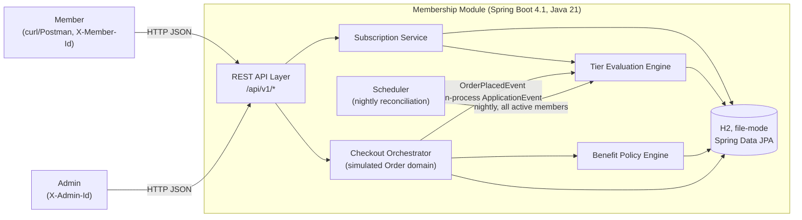

# High-Level Design — Membership Module

Staff-engineer HLD produced against `docs/prd/` (README + 01–09) after one round of Principal
Architect review (`docs/reviews/01-prd-architect-review.md`: 1 Blocker, 5 Major, 7 Minor). This
document's job is not to re-describe the PRD — it is to turn the PRD into something buildable in a
bounded window while explicitly resolving every Blocker/Major finding. Read this file first, then
the `docs/lld/*` files for implementation-level detail. PRD story/AC IDs (`MP-PLAN-*`, `MP-TIER-*`,
`MP-AC-***`, …) are preserved throughout so traceability holds end to end: PRD → review finding →
this design → the LLD section that implements it.

## 1. System Context

Single Spring Boot process, single H2 file-mode database, no external message broker, no external
payment gateway — consistent with the PRD's "zero-config, demo-able" constraint (README §3) and
with the review's confirmation that this is the correct scope tradeoff for a take-home window.

## 2. Component Breakdown

| Component | Responsibility | Depends on | LLD |
|---|---|---|---|
| **API Layer** | Controllers, DTO mapping, Bean Validation, `ProblemDetail` error translation, idempotency interceptor | Services | `05-api-layer.md` |
| **Subscription Service** | Subscribe/upgrade-downgrade-plan/cancel/renew state machine, `Subscription`/`MembershipStatus` writes | Tier Evaluation Engine (synchronous call at subscribe), Plan repository | `04-subscription-lifecycle.md` |
| **Tier Evaluation Engine** | `TierEvaluationService.evaluate(memberId)` — the single entry point for both triggers; `TierCriterionEvaluator` strategy registry | `MembershipStatus` lock, Order history read model | `02-tier-evaluation-engine.md` |
| **Benefit Policy Engine** | `BenefitResolutionService` — resolves applicable `BenefitEffect`s for a member/context; `BenefitPolicy` strategy registry | `TierBenefit` config | `03-benefit-policy-engine.md` |
| **Checkout Orchestrator** | Simulated `Order`/`OrderItem`, benefit snapshot at `startCheckout`, total computation, `OrderPlacedEvent` publication | Benefit Policy Engine | `07-checkout-integration.md` |
| **Scheduler** | `@Scheduled` nightly tier reconciliation (self-heal + window-expiry demotion); Increment-1+ | Tier Evaluation Engine | `02-tier-evaluation-engine.md` §5 |
| **Persistence Layer** | JPA entities, repositories, H2 (demo) / Postgres-compatible schema | — | `01-entity-and-schema-design.md` |
| **Concurrency/Idempotency** | Per-member lock registry, `IdempotencyRecord`, transaction boundaries | Persistence Layer | `06-concurrency-and-transactions.md` |

## 3. Day-1 Walking Skeleton vs. Later Increments

This is the direct answer to **Review Finding 1 (Blocker)**. The PRD as written has no thin-slice
cut line; this section is that cut line. "Day-1" means: the smallest set of entities, endpoints,
and flows that is genuinely runnable via `./gradlew bootRun` + curl and demonstrates the full
member journey — **subscribe → tier shows correctly → a benefit is visibly applied at simulated
checkout → upgrade/downgrade/cancel work** — plus the one scenario the brief explicitly calls out
as a bonus (concurrent tier recompute), because shipping that scenario is cheap once the tier
engine exists and it is the single highest-leverage proof point for the "concurrency" grading
criterion.

Everything else in the PRD is real, in-scope, and will be built — it is sequenced, not cut.

| | Day-1 walking skeleton | Increment 1 (MVP breadth) | Increment 2 (full PRD scope) |
|---|---|---|---|
| **Plans** | `MONTHLY`, `QUARTERLY`, `YEARLY` seeded via `CommandLineRunner` (MP-PLAN-01 read-only — all three cadences the brief names ship Day-1; `QUARTERLY` moved up from Increment 1 to close a literal-requirement gap) | Admin CRUD/lifecycle APIs (MP-PLAN-02/03) | Concurrent-edit `409` (MP-PLAN-EDGE-06 / MP-AC-049) |
| **Tiers/criteria** | `SILVER`/`GOLD`/`PLATINUM` seeded; **`ORDER_COUNT_MIN`, `ORDER_VALUE_MIN`, and `COHORT_MEMBERSHIP`** all wired through the full `TierCriterionEvaluator` strategy + registry (not hardcoded) — moved up from Increment 1, see LLD-02 §6. `GOLD`'s criteria set combines `ORDER_COUNT_MIN` with `COHORT_MEMBERSHIP(EARLY_ADOPTER)` via `ANY` (MP-AC-010), the first real (non-scratch-tier) tier a cohort criterion is attached to | admin criteria API (MP-API-12) | `ALL`/`ANY` admin combinator changes at scale, rank-collision validation polish |
| **Tier triggers** | Event-driven (in-process `ApplicationEvent`, synchronous-enough for a demo) + **the concurrent-order race scenario (MP-AC-014/015)** + a demo-only manual recompute trigger (`POST /internal/tier-recompute`, pulled explicitly into Day-1 per N5 below — it is Day-1's *only* backstop until the nightly batch ships) | Nightly `@Scheduled` reconciliation batch (window-expiry demotion, MP-AC-009; also closes the Day-1 self-heal gap, see Review Response N5) | Batch performance/backoff tuning |
| **Benefits** | `FREE_DELIVERY`, `PERCENTAGE_DISCOUNT` — both flow through checkout end to end | `EXCLUSIVE_DEALS_ACCESS` + minimal `Deal` read model, `PRIORITY_SUPPORT` entitlement flag; admin benefit API (MP-API-13/14) | `Deal` early-access boundary edge cases (MP-AC-024) |
| **Subscription lifecycle** | Subscribe, cancel, plan upgrade/downgrade (deferred-to-boundary, no proration) **and now actually applied at rollover** — `PendingPlanChangeApplier` + a real `@Scheduled` job (`PendingPlanChangeScheduler`) + a manual `POST /internal/subscriptions/apply-pending-plan-change` backstop, current-membership read | — | Auto-renew job's billing half: `PaymentStub` charge simulation, grace period, `PAYMENT_FAILED`→`EXPIRED` (MP-SUB-06) — the pending-change swap itself is Day-1 now, not this row |
| **Checkout** | `startCheckout` (benefit snapshot as JSON on `Order`), `computeTotals`, `placeOrder`, `OrderPlacedEvent` | Discount proportional-cap trimming across multiple lines (MP-CHK-EDGE-05) | Abandoned-checkout cleanup job (MP-CHK-EDGE-02) |
| **Idempotency** | `IdempotencyRecord` + interceptor on **`POST /subscriptions` and `POST /checkout` only** (the two endpoints with real duplicate-row risk, see Finding 5) | Extend to `PATCH .../plan`; `cancel`/`place` remain idempotent-by-construction (state-guarded), documented not "keyed" | `IdempotencyRecord` TTL cleanup job |
| **Admin surface** | none (seed data only), **plus a real `Cohort` catalog** (`GET /api/v1/cohorts`) and a **member self-service** cohort-choosing endpoint (`POST /api/v1/members/me/cohort`) — see the note below the table, this is *not* MP-API-15 shipped early, it's a materially different, smaller capability | Plan/tier/criteria/benefit admin APIs | Member cohort-assignment API (MP-API-15) — still not built |
| **Entities** | `Member`, `Plan`, `Subscription`, `MembershipStatus`, `Tier`, `TierCriteriaSet`, `TierCriterion`, `TierBenefit`, `Order`, `OrderItem`, `TierChangeLog`, `IdempotencyRecord`, `Cohort` (12 — `Cohort` added for the member-choose-cohort feature) | `Deal` | — (no new entities; `BenefitSnapshot` is a JSON column on `Order`, never a separate table — see LLD-01) |

**Note on the "Admin surface" row's cohort entry**: `POST /api/v1/members/me/cohort` is deliberately
*not* MP-API-15 built early. MP-API-15 (PRD 06 §2) is an **admin** endpoint — an operator assigns a
cohort to a member (`POST /admin/members/{memberId}/cohort`), matching PRD 02 §8 Q2's "cohort is a
static label ... assigned by an admin API." What shipped instead is **member self-service** — the
member sets their own cohort via `X-Member-Id`, no admin principal involved. Both are real, useful,
and eventually-both-built capabilities; they are not the same endpoint under two names, and this
row does not claim MP-API-15 is done — it remains open in the Increment 2 column.

**Day-1 acceptance bar** (concretely demoable via curl, no test harness required):
1. `GET /plans`, `GET /tiers` return seed data.
2. `POST /subscriptions {planCode: MONTHLY}` → `201`, `currentTier: SILVER`.
3. `POST /checkout` with an Electronics cart as a `GOLD`-seeded test member → response shows
   `PERCENTAGE_DISCOUNT`/`FREE_DELIVERY` actually reducing the total; `POST .../place` finalizes it.
4. Placing 5 orders for a `SILVER` member crosses `ORDER_COUNT_MIN` → tier becomes `GOLD`,
   `TierChangeLog` row written, visible on `GET /subscriptions/me`.
5. `PATCH /subscriptions/me/plan` (Monthly→Yearly) → `pendingPlanChange` shown, effective at
   period end.
6. `POST /subscriptions/me/cancel` → `CANCELLED`, benefits still present until period end.
7. Two concurrent order-placement requests for the same member that jointly cross a threshold
   (MP-AC-014/015) → tier ends up correct exactly once, no lost update — run as an integration test
   with two threads, not just curl, since it's timing-sensitive.

Everything in the "Increment 1/2" columns is explicitly in scope for the full engineering
milestone (the PRD's 50-scenario `09` suite remains the target definition of done) — this table
only orders the work so "running, demo-able" is achieved early and is never put at risk by
schedule pressure on the later, lower-marginal-value pieces (Finding 1's actual complaint).

**Day-1 tier-consistency bound, stated explicitly (added per second review pass, Finding N5)**:
ADR-004's 24-hour eventual-consistency ceiling for the tier-recompute pipeline is an
**Increment-1** property — it depends on the nightly batch, which doesn't exist on Day-1. On
Day-1, a failed/thrown tier recompute (`OrderPlacedEvent` listener) is caught, logged, and left
until someone calls the manual recompute trigger above; there is no automatic time-bounded
recovery yet. This is an accepted, explicitly-recorded gap for the walking-skeleton slice — see
`docs/lld/02-tier-evaluation-engine.md` §3.1 for the full statement and
`docs/lld/07-checkout-integration.md` §4 for how it interacts with ADR-004.

## 4. Technology Choices & Rationale

| Decision | Choice | Rationale |
|---|---|---|
| Persistence | Spring Data JPA (Hibernate) + H2, file-mode (`jdbc:h2:file:./data/membership;AUTO_SERVER=TRUE`) | Zero-config `./gradlew bootRun`, persists across restarts, schema written Postgres-compatible (standard SQL types, `TEXT` not H2-JSON). **Required addition for engineering**: `build.gradle` currently has no persistence dependency — add `spring-boot-starter-data-jpa` and `com.h2database:h2` (runtime scope). This document does not edit `build.gradle`; flagged here as the actionable item. |
| Concurrency (tier recompute chokepoint) | **Dual-layer**: in-process per-member `ReentrantLock` (primary, correct-by-construction for the stated single-instance deployment) + DB `SELECT ... FOR UPDATE` pessimistic lock on `MembershipStatus` (defense-in-depth today, becomes primary once scaled to multi-instance/Postgres) | See ADR-003 below and `06-concurrency-and-transactions.md` §1 — this is the direct resolution of Finding 4; it does not assert H2's `FOR UPDATE` blocking semantics are proven, and doesn't need to, because correctness does not depend solely on them. |
| Concurrency (rare-conflict paths) | Optimistic `@Version` (`Plan`, `Subscription`, `TierCriteriaSet`, `TierBenefit`) | Conflicts are rare + a client retry is cheap/visible here, unlike the tier-recompute chokepoint. Unchanged from PRD 08 §2, which the review calls the best-argued section of the PRD. |
| Event mechanism | `OrderPlacedEvent` published in-process (`AFTER_COMMIT` via `@TransactionalEventListener`), handed off to a Redis Stream (`XADD`) for the actual tier recompute, consumed by `TierRecomputeStreamConsumer` via a consumer group | Originally in-process-only, no broker (ADR-004, resolves Finding 3) — superseded by ADR-004's 2026-08-17 addendum after a real production bug (`TransactionRequiredException` on every order placement) turned out to require a genuinely separate execution context, not just a retry. Redis is now a real infra dependency; see the addendum for why Redis Streams over a DB outbox table. |
| Scheduling | Spring `@Scheduled` (single JVM, no distributed scheduler) | Matches single-instance assumption (PRD 08 §1); trivial to swap for ShedLock/Quartz if the deployment ever scales out. First real instance shipped: `PendingPlanChangeScheduler` (pending-plan-change rollover, §3 above). The nightly tier-reconciliation batch on this same mechanism remains Increment 1. |
| Benefit/criteria parameters | `TEXT` column + Jackson (de)serialization to a config type owned by each policy/evaluator, validated at admin-write time | Keeps a new benefit/criterion type additive at the schema level — the concrete mechanism behind the extensibility claim (PRD 07 §5 Q2). |
| Strategy registry key type | **`String`**, not the `TierCriterionType`/`BenefitType` enum (the enums remain as a shipped-type catalog for seed data/DTOs only) | See ADR-006 below (resolves Finding N4) — a closed enum cannot be extended from outside its owning file, which made the original extensibility-proof tests uncompilable. |
| Idempotency | `IdempotencyRecord` table + a request-scoped interceptor, **scoped to the two endpoints that need it** (see ADR-005) | Resolves Finding 5 — was previously claimed for 5 endpoints, tested for 1. |

## 5. Major Tradeoffs

- **In-process locking as the primary concurrency guarantee, not H2's row-lock behavior.** Trades
  "prove H2 blocks identically to Postgres" (expensive, uncertain, exactly the kind of spike a
  take-home window doesn't budget for) for "make the demo's correctness independent of that
  question." The cost is that this specific in-process lock does not generalize to a
  multi-instance deployment as-is — documented explicitly as a follow-on (the DB lock is what
  generalizes; see `06-concurrency-and-transactions.md` §1.4).
- **Seed-data-first, admin-API-second.** Day-1 ships with `CommandLineRunner` seed data and no
  admin mutation endpoints, deliberately delaying "configurable at runtime" (a real Req 4
  requirement) to Increment 1. This trades literal Day-1 completeness against the brief's harder
  constraint ("running, demo-able") — the tier/benefit *abstractions* are still fully in place
  Day-1 (interfaces + strategy registry), only the *admin HTTP surface* to mutate them via API
  ships slightly later. Configurability-via-seed-data-restart is an acceptable Day-1 substitute;
  configurability-via-live-API is Increment 1, not cut.
- **`BenefitSnapshot` as a JSON column on `Order`, not a separate entity.** The PRD's ER diagram
  (07 §2) draws it as its own box; this design collapses it into `Order.benefitSnapshotJson`
  (already listed as a field in PRD 07 §3's `Order` table) since it has no independent lifecycle,
  identity, or query pattern of its own — it is written once, read once, per order. This shaves an
  entity off the Blocker's "~14 entities" count for free, with no behavior change.
- **Idempotency scoped down, not generalized.** Trades "a fully generic idempotency framework
  across 5 endpoints" for "a correct, tested mechanism on the 2 endpoints where it's load-bearing,"
  plus explicit documentation of why the other 3 don't need it (state-machine guards / natural
  idempotency already make them safe). Cheaper to build, and closes Finding 5's actual gap (tests
  didn't match claims) rather than writing more untested claims.

## 6. Architecture Decision Records

### ADR-001 — Persistence: Spring Data JPA + H2 (file-mode), Postgres-compatible schema
**Status**: Accepted (inherited from PRD 07 §1, re-affirmed here).
**Context**: No persistence dependency exists in `build.gradle` yet; must be zero-config runnable
and support the concurrency mechanisms in ADR-003.
**Decision**: `spring-boot-starter-data-jpa` + `com.h2database:h2`, file-mode datasource,
`ddl-auto=update` + `CommandLineRunner` seeding for the demo; standard SQL types only (no
H2-specific JSON type) so a Postgres cutover is a datasource + Flyway change, not a redesign.
**Consequences**: Engineering must add the two Gradle dependencies (flagged, not applied by this
design work). `ddl-auto=update` is acceptable for a demo but is explicitly *not* a production
migration strategy — Flyway is the stated follow-on (unchanged from PRD).

**Addendum (2026-08-16) — superseded: H2 file-mode → Postgres + Liquibase.** The "real DB
migration later" flagged above has now happened. Persistence is Spring Data JPA against Postgres
16 (run locally via `docker-compose.yml`, `docker compose up -d`), and schema ownership moved from
Hibernate `ddl-auto=update` to versioned Liquibase changelogs
(`src/main/resources/db/changelog/db.changelog-master.yaml`, one file per table); Hibernate is now
`ddl-auto=validate` only — it verifies the mapping matches the Liquibase-applied schema and never
generates DDL itself. The changelogs were derived from Hibernate's own schema-export output
against a scratch Postgres database (not hand-written from memory of the entity classes) to avoid
drift between what's annotated and what's migrated, then annotated with explicit `addForeignKeyConstraint`
steps for the relationships the ER diagram in `docs/lld/01-entity-and-schema-design.md` §2 already
implies but that plain-UUID-column entities (no JPA `@ManyToOne`) don't get for free from Hibernate's
exporter. This also surfaced and fixed a latent, H2-masked bug: `@Lob` on a `String` field maps to
a Postgres `oid` large-object reference, not a `TEXT` column — contradicting this document's own
"standard SQL types... `TEXT` not H2-JSON type" claim above; every JSON-blob column
(`paramsJson`, `benefitSnapshotJson`, `pendingPlanChangeJson`, `responseBodyJson`) now uses
`@Column(columnDefinition = "TEXT")` instead. Tests were switched from H2 to Testcontainers
(a real ephemeral Postgres container per test JVM, singleton-container pattern), which is also the
concrete resolution of **Finding N6** (§9 below): the concurrency test (MP-AC-014/015) and the
double-subscribe unique-constraint test now run against genuine Postgres locking/constraint
behavior instead of an unverified assumption about H2 parity.

### ADR-002 — Tier is earned at subscribe/behavior time, never user-chosen
**Status**: Accepted, promoted from "resolved open question" to a flagged, sign-off-worthy
decision per Review Finding 2.
**Context**: The brief's literal text ("Subscribe to a plan (plan + tier)", "Upgrade, downgrade
(Membership Tier)... a subscription") is at least as consistent with a *priced, user-selectable*
tier model (e.g., "Gold Yearly costs more than Silver Yearly") as with the criteria-driven model
Req 4 unambiguously describes. Both readings are plausible; they are not compatible with each
other.
**Decision**: Build the criteria-driven reading. At subscribe time the member chooses only the
**Plan**; **Tier** is system-assigned (`SILVER` default, or higher if pre-existing history/cohort
already qualifies) and continuously re-evaluated. The user-facing "upgrade/downgrade... tier"
action in the brief is reinterpreted as a **Plan** cadence change; there is no member-facing
tier-mutation endpoint.
**Rationale for choosing this reading over the literal one**: a user-selectable tier is
structurally incompatible with Req 4's criteria engine (anyone could self-declare Platinum on day
one), and building both readings is not a good use of a bounded window.
**Delta if the literal reading were intended instead** (recorded for the record, not built):
  - Pricing becomes per-`(plan, tier)`, not per-`plan` — `Subscription.priceAtSubscription` would
    need to snapshot from a `PlanTierPrice` join, not `Plan` alone.
  - `PATCH /subscriptions/me/plan` would need a tier-selection parameter and a payment/upgrade-fee
    concept; there would be no behavioral tier engine at all, only "auto-suggest an upgrade the
    user must accept" — a materially smaller, materially different system (no criteria engine, no
    `TierCriterionEvaluator`, no MP-AC-014/015 concurrency story).
  - This delta is why this decision is called out as the single highest-risk assumption in the
    whole design: if wrong, most of `02-tier-evaluation-engine.md` and `06 §1` (the concurrency
    chokepoint) would not need to exist.
**Consequences**: If an evaluator intended the literal reading, this system answers a different
question than the one asked, by design. This is accepted as the more defensible engineering
reading, with the delta above recorded so the gap is legible, not silent.

### ADR-003 — Concurrency at the tier-recompute chokepoint: dual-layer locking, H2 behavior not asserted
**Status**: Accepted.
**Context** (Review Finding 4): PRD 08 §2 designs the headline concurrency scenario
(MP-AC-014/015) around `SELECT ... FOR UPDATE` / `@Lock(LockModeType.PESSIMISTIC_WRITE)` against
H2 in file-mode, and separately claims Postgres-compatibility — but H2's MVStore locking semantics
under this exact configuration were never empirically verified, and the review specifically flags
that "tests could pass for the wrong reason" if H2 doesn't actually block the second transaction.
**Decision**: Do not make correctness depend on H2's `FOR UPDATE` blocking behavior at all.
Correctness is provided by an **in-process per-member `ReentrantLock`** (a `MemberLockRegistry`
singleton bean, `ConcurrentHashMap<UUID, ReentrantLock>`), acquired before the transactional
evaluation body runs and held for its duration. This is correct-by-construction given the PRD's
own stated deployment assumption (single instance, PRD 08 §1) — no JVM-level race is possible
regardless of what H2 does. The DB pessimistic lock is **retained**, not dropped, as a
defense-in-depth layer and as the mechanism that will become load-bearing once/if the system is
scaled to multiple instances against Postgres (where row-level `FOR UPDATE` blocking is a
well-established guarantee, unlike the H2 question this ADR is sidestepping).
**What is verified vs. assumed, stated explicitly**: The in-process lock's correctness is verified
by ordinary Java concurrency reasoning (a single `ReentrantLock` per key, held across the critical
section, in a single JVM, is not in question). The DB lock's *blocking* behavior under H2
file-mode is explicitly **not** verified by this design — a concrete spike test is specified in
`06-concurrency-and-transactions.md` §1.3 as a Day-1 gating task; its outcome does not change the
design's correctness (the in-process lock already provides it) but its result must be recorded so
"the concurrency tests are believed-correct or empirically-proven" is a known, not assumed, fact
per the review's own recommendation.
**Consequences**: One additional small component (`MemberLockRegistry`) not in the original PRD.
Documented limitation: this specific lock does not generalize past one instance; that generalization
step is called out as a named follow-on, matching the PRD's own existing single-instance caveat
(08 §1), not a new one.
**Implementation note added post-verification (Finding N1)**: the first-pass code sketch
implementing this ADR had `TierEvaluationService.evaluate()` call its own `@Transactional` method
via a same-class (`this.`) invocation — a Spring AOP self-invocation bug that silently bypasses the
proxy and disables the transaction, undermining the "held for the duration of one evaluation"
half of the defense-in-depth claim above (the primary `ReentrantLock` guarantee was unaffected).
Fixed by splitting the transactional body into a separate bean
(`TierEvaluationTransactionalOps`) called through its own proxy — see
`docs/lld/02-tier-evaluation-engine.md` §2 and `docs/lld/06-concurrency-and-transactions.md` §1.2
for the corrected design. This does not change the ADR's decision, only corrects a bug in its
first-pass implementation.

### ADR-004 — Drop "outbox/retry pattern"; nightly batch is the sole tier-recompute resilience mechanism
**Status**: Accepted.
**Context** (Review Finding 3): PRD `05` and `README` both mention an "outbox/retry pattern" for a
failed tier recompute after order placement, but no `Outbox` entity, dispatcher, or retry/backoff
policy is specified anywhere, and `02 §5` already gives a simpler, fully-specified story (the
nightly batch self-heals missed/failed event processing).
**Decision**: Drop all "outbox" language. `OrderPlacedEvent` is published in-process via
`@TransactionalEventListener(phase = AFTER_COMMIT)`; the listener's tier-recompute call is
wrapped so any exception is logged and swallowed, never propagated back to the placing request
(order placement itself never fails or rolls back because of a tier-recompute failure —
MP-CHK-04's actual requirement). The nightly `@Scheduled` reconciliation batch (`02 §5`,
Increment 1) is the sole, sufficient mechanism that guarantees eventual correctness (24h worst
case, matching PRD 08 §6's stated bound) for any missed or failed event.
**Rationale**: A transactional outbox is real, valuable distributed-systems engineering — for a
system with a message broker or multiple writers to coordinate across. This system has neither;
building an outbox here would be unbudgeted design/engineering weight for a guarantee the nightly
batch already provides at the stated bound.
**Consequences**: `MP-AC-047` ("order placement succeeds even when the tier consumer throws") is
satisfied by the try/catch-and-log listener design, not by a retry queue; "eventually reflected"
in that scenario means "by the next nightly batch run, or a manually-triggerable re-evaluation
endpoint for demo purposes," not "automatically retried within seconds." This is stated explicitly
so nobody discovers the gap by reading test assertions.
**Addendum (Finding N5, second review pass)**: the "24h worst case" bound in the Decision above
holds from **Increment 1 onward** (once the nightly batch exists), not on Day-1, where the nightly
batch has not shipped yet. This sequencing gap was not stated explicitly in the first pass, which
read as though the bound already held. It is now stated in §3 above and in
`docs/lld/02-tier-evaluation-engine.md` §3.1: Day-1's bound is session-scoped/best-effort, backed
only by the manually-triggerable recompute endpoint, which is pulled explicitly into the Day-1
scope column for exactly this reason.

**Addendum (2026-08-17) — superseded in part: `OrderPlacedEvent` → tier-recompute now goes through
Redis Streams, not a direct in-process call.** `docs/reviews/04-e2e-prd-verification.md` FAIL #1
found that the direct-call design this ADR settled on had a real, 100%-reproducible bug in
production, not just a theoretical gap: `TierRecomputeOnOrderPlacedListener`'s
`@TransactionalEventListener(phase = AFTER_COMMIT)` method called
`TierEvaluationService.evaluate(...)` directly, and that call — a nested `@Transactional` call —
runs synchronously *inside* Spring's `AFTER_COMMIT` transaction-synchronization callback, which
itself executes as part of the placing transaction's own `commit()` sequence. A fresh transaction
could not reliably bind in that exact execution context, so every real order placement threw
`TransactionRequiredException: No active transaction`, silently swallowed by the very try/catch
this ADR specified — meaning tier promotion from real orders **never actually happened live**,
only via `SUBSCRIBE` or the manual `/internal/tier-recompute` trigger. This is a structural problem
(the listener needs a genuinely separate execution context, not just a retry), not the kind of gap
an `@Async` annotation alone reliably closes — `@Async` moves the call to a different thread, which
likely would have worked, but gives up durability: a crash or restart between publish and
processing loses the event entirely, with no replay.
**Decision**: `TierRecomputeOnOrderPlacedListener` now only publishes a small message (`memberId`,
`orderId`, `triggeredBy`) to a Redis Stream (`XADD`) — not a JPA call, so it cannot hit the original
bug. A new consumer (`tier.service.TierRecomputeStreamConsumer`, via Spring Data Redis's
`StreamMessageListenerContainer` and a consumer group) reads the stream on its own polling thread,
genuinely outside any transaction-completion callback, and calls
`TierEvaluationService.evaluate(...)` as a true top-level call — the structural mismatch that
caused the bug cannot recur here, by construction. `XACK` only happens after `evaluate()` succeeds;
an unacknowledged message stays in the consumer group's pending-entries list, reclaimable later —
matching this ADR's original "no custom retry/backoff policy" scoping, just on a different
transport.
**Why Redis Streams and not a DB outbox table** (the alternative this ADR originally rejected for a
different reason): an outbox table would also fix the structural bug — a second table plus a
`@Scheduled` relay polling it would equally give the consumer a fresh execution context. Redis
Streams was chosen instead because (a) it needs no separate relay/dispatcher process — the stream
*is* the queue, Spring Data Redis's consumer-group support is push-based, not a polling loop this
codebase would have to hand-write; (b) it comes with consumer groups, delivery tracking, and a
pending-entries list built in, which an outbox table would require reimplementing by hand; (c) this
is still a single-instance deployment (unchanged from this ADR's original context), so Redis's own
persistence (the `redis:7-alpine` container's default RDB snapshotting, backed by the named volume
in `docker-compose.yml`) is sufficient durability — a distributed, multi-instance-safe broker was
never the requirement here, only "survives a restart, doesn't require the listener to run inside a
commit callback."
**Consequences**: this reverses the "no outbox, no broker" half of the original Decision above —
Redis is now a real infrastructure dependency (`docker-compose.yml`'s `redis` service), not just a
DB-only design. The "sole tier-recompute resilience mechanism is the nightly batch" framing is also
narrowed: the Redis Stream pipeline is now the *primary* live mechanism (working automatically,
unlike before), with the manual `/internal/tier-recompute` trigger and the future nightly batch
remaining as the self-heal path for the (now much narrower) set of failures — Redis being briefly
unreachable, or the consumer itself throwing — not for the every-single-order failure this ADR
originally, unknowingly, shipped. See `docs/lld/02-tier-evaluation-engine.md` §3/§3.2 for the
updated trigger-point detail.

### ADR-005 — Idempotency scoped to `POST /subscriptions` and `POST /checkout`
**Status**: Accepted.
**Context** (Review Finding 5): PRD 08 §4 claims `Idempotency-Key` support across 5 endpoints;
only 1 (`POST /subscriptions`) has acceptance-test coverage, and the PRD's own risk narrative
("two retried calls without a key would otherwise create two separate `Order` rows") points
specifically at `POST /checkout`, which had zero coverage.
**Decision**: Build the keyed `IdempotencyRecord` mechanism for exactly the two endpoints where a
retried request would otherwise cause an unsafe double side-effect: `POST /subscriptions`
(double subscription row — also backstopped by a DB partial unique index, belt-and-suspenders) and
`POST /checkout` (double `Order` row — no DB constraint backstops this one, so the key mechanism is
load-bearing here, not just defense-in-depth). The other three mutating endpoints are
**idempotent-by-construction** and documented as such rather than given a redundant key mechanism:
`cancel` converges on `CANCELLED` regardless of call count (MP-SUB-04); `PATCH .../plan` is
naturally safe to retry because it's a full-state overwrite guarded by optimistic `@Version`, not
an additive operation; `POST /checkout/{id}/place` is guarded by an atomic
`WHERE status = 'CHECKOUT_STARTED'` transition (a second call is a `409`, not a duplicate action).
**Consequences**: Every idempotency-bearing endpoint now has a matching guarantee *and* a matching
test obligation (`06-concurrency-and-transactions.md` §3); no endpoint claims a guarantee that
isn't built or tested. `PATCH .../plan` accepting an `Idempotency-Key` header per the PRD's API
contract (06) is retained as an accepted-but-ignored optional header for API-shape compatibility,
not wired to `IdempotencyRecord` — called out so it isn't mistaken for silent breakage.

### ADR-006 — Strategy registries (`TierCriterionEvaluator`, `BenefitPolicy`) are keyed by `String`, not by their catalog enum
**Status**: Accepted.
**Context** (Review Finding N4, second review pass): the extensibility-proof tests specified as
the direct fix for the original review's Finding 6 (`docs/lld/02-tier-evaluation-engine.md` §6,
`docs/lld/03-benefit-policy-engine.md` §5) register a fictitious strategy for a type that "does not
exist in production code." As first specified, that type was a value of `TierCriterionType`/
`BenefitType` — ordinary, closed Java `enum`s — which cannot be extended from test code without
editing the production enum source file, defeating the test's own "pure addition, zero production
touch" premise. The same closedness problem existed one layer deeper for benefits: `BenefitConfig`
was a `sealed interface` with a fixed `permits` list, parsed by a central switch-like dispatcher —
equally unextendable from outside its declaring file.
**Decision**: The registries are keyed by `String`, not by the enum. `TierCriterionType` and
`BenefitType` still exist, unchanged in spirit, as a **shipped-type catalog** — convenient,
type-safe references for seed data, admin API DTOs, and `TierChangeLog.reason` — but
`TierCriterionEvaluator.supportedType()`/`BenefitPolicy.supportedType()` return `String`
(`SomeType.name()` for shipped types, an arbitrary string for a test-only or future out-of-tree
type), and the registries' backing maps are `Map<String, ...>`. Separately, `BenefitConfig` changes
from a `sealed interface` with a fixed `permits` list to an **open marker interface**, and
`BenefitPolicy` now owns parsing its own config from raw JSON (`parseConfig(String paramsJson)`)
rather than a central registry-keyed parser switching over a closed hierarchy — removing the
second, deeper instance of the same closedness problem.
**Rationale**: This is the smaller of the two fixes the review offered (keep enums as shipped-type
convenience, open the registry key type) over the alternative (accept the test can only be written
via reflection/dynamic substitution of the registry's internal map). String-keying is simpler to
explain, requires no reflection trickery in test code, and has a pleasant side effect: it is also
exactly the type `TierCriterion.type`/`TierBenefit.benefitType` already are at the persistence
layer (`docs/lld/01-entity-and-schema-design.md` §2's ER diagram used `string` for both from the
first pass) — this fix makes the Java-side interface consistent with the schema that already
existed, rather than introducing a new inconsistency.
**Consequences**: `BenefitEffect`'s `source` field also changes from `BenefitType` to `String` for
the same reason (an extensibility-test policy needs to produce a real, renderable effect without a
`BenefitType` constant existing). `BenefitEffect` itself remains a closed `sealed` hierarchy
deliberately — see `docs/lld/03-benefit-policy-engine.md` §6's explicit, unchanged carve-out that a
wholly new *effect shape* (not a new *policy* reusing an existing shape) is the one place adding a
benefit type still requires a small, accepted touch. The extensibility-proof tests in LLD-02 §6 and
LLD-03 §5 are rewritten against this design and now compile.

## 7. Review Finding → Resolution Mapping

| # | Severity | Finding (paraphrased) | Resolved in |
|---|---|---|---|
| 1 | Blocker | No thin-slice cut line; MVP too large for a bounded window | §3 above — explicit Day-1 walking skeleton / Increment 1 / Increment 2 split |
| 2 | Major | Tier-earned-vs-chosen silently overrides literal brief text | ADR-002 above — promoted to a flagged decision with recorded delta |
| 3 | Major | "Outbox/retry pattern" named twice, defined nowhere, contradicts nightly-batch story | ADR-004 above; mechanism detailed in `07-checkout-integration.md` §4 |
| 4 | Major | H2 pessimistic-locking behavior asserted, never validated | ADR-003 above; spike test and dual-layer design in `06-concurrency-and-transactions.md` §1 |
| 5 | Major | Idempotency claimed for 5 endpoints, tested for 1 | ADR-005 above; mechanism + full test obligation list in `06-concurrency-and-transactions.md` §3 |
| 6 | Major | Acceptance criteria are all behavioral; a hardcoded switch could pass everything | `02-tier-evaluation-engine.md` §6 and `03-benefit-policy-engine.md` §5 — concrete extensibility-proof tests + an ArchUnit structural rule named explicitly |
| 7 | Minor | `TierCriteriaSet` claimed versioned in `06` but has no `version` field in `07` | `01-entity-and-schema-design.md` — `version` added to `TierCriteriaSet` |
| 8 | Minor | `422` reserved but never used | Dropped from this design's error-code table (`05-api-layer.md` §4); not resurrected without a real case |
| 9 | Minor | `09`'s traceability claim overstates coverage of degrade-gracefully edge cases | Named explicitly in `06-concurrency-and-transactions.md` §3 and `03-benefit-policy-engine.md` §5 as required Increment-1 test additions, not silently left overstated |
| 10 | Minor | "Birthday bonus" extensibility example needs `Member.dateOfBirth`, which doesn't exist | `03-benefit-policy-engine.md` §6 uses a referral-bonus example instead, additive under the current schema |
| 11 | Minor | README's "optimistic locking" one-liner contradicts the actual dual (optimistic+pessimistic) design | This document's own wording (§4 table, ADR-003) states the dual model precisely; no "optimistic-only" claim appears anywhere in this design |
| 12 | Minor | `MembershipStatus.version` is redundant given the pessimistic lock | Kept, with the rationale stated explicitly in `01-entity-and-schema-design.md` — defense-in-depth for any future write path that doesn't go through `TierEvaluationService` |
| 13 | Minor | `MP-AC-034` tests idempotency, not a real concurrent-cancel race | `06-concurrency-and-transactions.md` §3 reclassifies it and adds a genuinely concurrent variant alongside the `MP-AC-028`-style pattern |

## 8. Traceability

Every PRD ID (`MP-PLAN-*`, `MP-TIER-*`, `MP-BEN-*`, `MP-SUB-*`, `MP-CHK-*`, `MP-API-*`,
`MP-DATA-*`, `MP-NFR-*`, `MP-AC-***`) referenced anywhere in `docs/prd/` is preserved verbatim in
the `docs/lld/*` files that implement it — no ID is renamed or renumbered by this design. New
IDs introduced by this design (none are strictly required, but section anchors like "ADR-00N" and
"LLD-0N §M" are used consistently) are local to `docs/hld/` and `docs/lld/` and are not meant to
replace the PRD's scheme, only to extend it downward into implementation detail.

## 9. Review Response — Second Architect Review (`docs/reviews/02-hld-lld-architect-review.md`)

Verdict: **Approved with required fixes** — 5/6 original Blocker/Major findings resolved outright,
1/6 (Finding 6) resolved in spirit but with a concrete implementability defect in its own test
design. This pass also surfaced six new findings (N1–N6) — three bugs a developer implementing the
LLDs literally would have shipped, plus three lower-severity gaps. All six are addressed below,
same mapping pattern as §7 above.

| # | Sev | Finding (paraphrased) | Fixed in |
|---|---|---|---|
| N1 | Major | `TierEvaluationService.evaluate()` calls its own `@Transactional` method via `this.` — Spring AOP self-invocation silently disables the transaction, so the `MembershipStatus` write + `TierChangeLog` insert aren't actually atomic, and the DB lock isn't actually held for the claimed duration | `docs/lld/02-tier-evaluation-engine.md` §2 and `docs/lld/06-concurrency-and-transactions.md` §1.2 — split into two beans (`TierEvaluationService` holds the lock, `TierEvaluationTransactionalOps` is a separate `@Transactional` collaborator called through its own proxy); ADR-003 in this file carries an implementation-note addendum |
| N2 | Major | `BenefitResolutionService.resolveApplicable` dereferences `tier.id()` with no null check, but non-member checkout calls it with an absent tier (`MP-CHK-EDGE-03`/`MP-AC-045`) — guaranteed `NullPointerException` → `500` | `docs/lld/03-benefit-policy-engine.md` §1 (`BenefitContext.tier()` is now `Optional<Tier>`) and §2 (explicit, named empty-tier branch returning `List.of()` first, before any dereference); `docs/lld/07-checkout-integration.md` §5's `MP-CHK-EDGE-03` bullet updated to match |
| N3 | Major | Checkout's tier-resolution gate read as "empty if no `ACTIVE` subscription," which would zero out benefits for a `CANCELLED`-but-still-in-period member, contradicting `MP-SUB-04`/`MP-AC-032` | `docs/lld/07-checkout-integration.md` §2 — gate restated as explicit pseudocode keyed on "still within paid period" (`ACTIVE`, or `CANCELLED`/`PAYMENT_FAILED` with period/grace not yet elapsed), not literal `status == ACTIVE`; cross-referenced from `docs/lld/04-subscription-lifecycle.md` §1 so the two documents state the same rule consistently |
| N4 | Major | The extensibility-proof tests (the direct fix for the original review's Finding 6) require adding a constant to `TierCriterionType`/`BenefitType`, closed Java `enum`s — doesn't compile from test code, defeating the test's own "no production touch" premise | ADR-006 above; `docs/lld/02-tier-evaluation-engine.md` §1/§6 and `docs/lld/03-benefit-policy-engine.md` §1/§5 — registries re-keyed to `String`, `BenefitConfig` changed from a sealed hierarchy to an open marker interface with policy-owned parsing, both extensibility tests rewritten to register a bean under an arbitrary string key with no enum/sealed-type edit; now compiles |
| N5 | Major | ADR-004's "24h worst case" resilience bound assumes the nightly batch exists, but the batch is Increment-1 scope while the swallow-and-log listener ships Day-1 — Day-1 has no stated compensating mechanism | `docs/hld/README.md` §3 (Day-1 tier-consistency bound stated explicitly; manual recompute trigger pulled into the Day-1 column) and ADR-004 addendum above; full statement in `docs/lld/02-tier-evaluation-engine.md` §3/§3.1, cross-referenced from `docs/lld/07-checkout-integration.md` §4 |
| N6 | Major | The Day-1 partial/filtered unique index on `Subscription` was asserted "verified" for H2 syntax compatibility without actually being verified — the same class of overclaim as the original review's Finding 4, for a different H2 feature | `docs/lld/01-entity-and-schema-design.md` §4 — "verified" claim removed, reframed as a Day-1 gating spike task (mirroring the locking spike in `06-concurrency-and-transactions.md` §1.3) with a concrete, DB-backed fallback design (nullable-mirror-column unique index) specified in advance |

**Minor findings also addressed while making the above changes** (not explicitly requested as
priority, low-risk/opportunistic per the coordinator's instructions): N7 (seed-data ambiguity about
whether the Day-1 `GOLD` test member has a pre-seeded `Subscription`) — clarified in
`docs/lld/01-entity-and-schema-design.md` §6, the member is seeded via the real
`TierEvaluationService.evaluate` path, not hand-computed. N8 (manual recompute trigger's shipping
increment was ambiguous) — resolved as part of N5's fix; it is now explicitly Day-1 in both
`docs/hld/README.md` §3 and `docs/lld/02-tier-evaluation-engine.md` §3.

No original ADR (002–005) was reopened or reversed by this pass — every N1–N6 fix is either a
same-bean-boundary code-level correction (N1, N2, N3), a registry key-type correction that doesn't
change any decision's substance (N4/ADR-006 is additive, not a reversal), or an explicit
documentation of a sequencing gap that already existed in the increment plan (N5, N6). Nothing here
requires revisiting the entity model or the Day-1/Increment-1/Increment-2 cut line.
