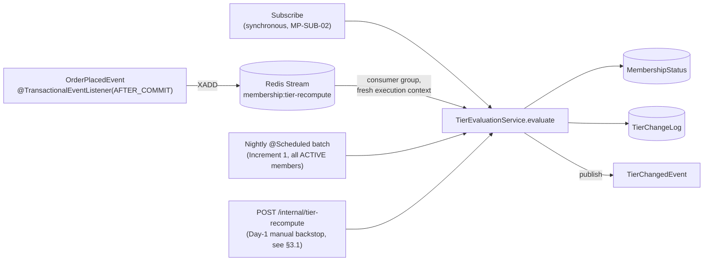
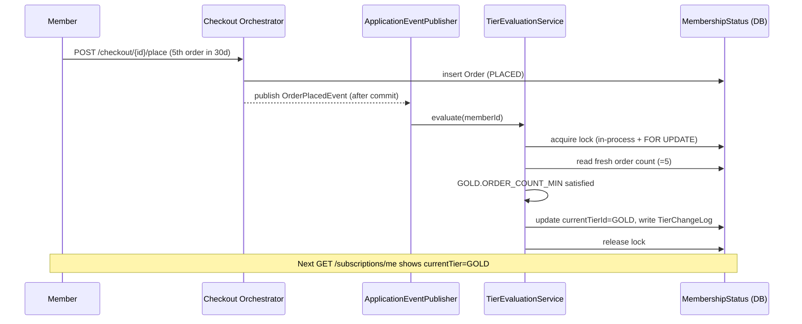

# LLD-02 — Tier Evaluation Engine

Implements PRD `02-membership-tiers.md` (`MP-TIER-*`). This is the component the review's
Finding 6 is most concerned about: the abstraction must be real (interfaces + a registry), not
prose, and this document names the specific tests that make the abstraction's presence
mechanically checkable.

## 1. The Criterion Abstraction

> **N4 fix (second review pass)**: the registry is keyed by `String`, not by the
> `TierCriterionType` enum. `TierCriterionType` still exists as a **shipped-type catalog** —
> convenient for seed data, admin API DTOs, and `TierChangeLog.reason` — but it is no longer the
> type that flows through `TierCriterionEvaluator`/the registry. This is what makes the registry
> genuinely open for extension from outside this package (including from test code, which cannot
> add a constant to a closed production `enum` — see §6 Test 1 for why this matters).

```java
public enum TierCriterionType { ORDER_COUNT_MIN, ORDER_VALUE_MIN, COHORT_MEMBERSHIP /* shipped-type catalog only — NOT the registry key, see note above */ }

public interface TierCriterionEvaluator {
    String supportedType(); // e.g. TierCriterionType.ORDER_COUNT_MIN.name() for shipped types;
                             // an arbitrary string for a test-only or future out-of-tree type
    boolean isSatisfied(TierCriterion criterion, TierEvaluationContext context);
    CriterionProgress progress(TierCriterion criterion, TierEvaluationContext context);
}

public record TierEvaluationContext(
    UUID memberId,
    Clock clock,                       // injected, never Instant.now() — MP-NFR-06
    OrderHistoryReader orderHistory,    // count/value in a trailing window, reads fresh inside the lock
    String cohortCode
) {}

public record CriterionProgress(String type, String currentValue, String requiredValue) {}
```

`TierCriterion.type` (the persisted column, LLD-01 §2 ER diagram) is a plain `String` — it always
was modeled that way at the schema level; this fix aligns the Java-side interface with the schema
that already existed, rather than the other way around.

`OrderHistoryReader` is a small read-model port (`countSince(memberId, since)`,
`totalValueSince(memberId, since)`) backed by `OrderRepository` — kept as an interface so a unit
test can supply a fake without a DB.

### Registry (Spring strategy-registry idiom, string-keyed)

```java
@Component
public class TierCriterionEvaluatorRegistry {
    private final Map<String, TierCriterionEvaluator> evaluators;

    // Spring injects every bean implementing TierCriterionEvaluator into this List
    public TierCriterionEvaluatorRegistry(List<TierCriterionEvaluator> beans) {
        this.evaluators = beans.stream()
            .collect(Collectors.toMap(TierCriterionEvaluator::supportedType, Function.identity()));
    }

    public TierCriterionEvaluator get(String type) {
        TierCriterionEvaluator e = evaluators.get(type);
        if (e == null) throw new UnresolvableCriterionTypeException(type); // never reached in
            // practice for well-formed seed/admin data; TierCriteriaSet writes are validated
            // against this same registry at admin-write time (05-api-layer.md §3)
        return e;
    }
}
```

### Concrete strategies

| Class | `supportedType()` | Ships | Logic |
|---|---|---|---|
| `OrderCountMinEvaluator` | `TierCriterionType.ORDER_COUNT_MIN.name()` | Day-1 | `orderHistory.countSince(memberId, clock.instant().minus(windowDays)) >= minCount` |
| `OrderValueMinEvaluator` | `TierCriterionType.ORDER_VALUE_MIN.name()` | Increment 1 | `orderHistory.totalValueSince(...) >= minValue` |
| `CohortMembershipEvaluator` | `TierCriterionType.COHORT_MEMBERSHIP.name()` | Increment 1 | `cohortCode != null && cohortCode.equals(criterion.cohortCode())`; unresolvable/unknown cohort → `false`, never throws (MP-TIER-EDGE-05) |

Adding `ORDER_VALUE_MIN` in Increment 1 is: (1) add the `TierCriterionType` enum value (catalog
convenience, seed data/DTOs only), (2) write `OrderValueMinEvaluator implements
TierCriterionEvaluator` returning that value's `.name()` from `supportedType()`, (3) register it
as a `@Component` (Spring picks it up into the `List<TierCriterionEvaluator>` constructor
injection automatically — no registry code changes). **Zero lines change in
`TierEvaluationService` or the registry.** This is the literal exercise Review Finding 6 asks the
LLD to make explicit — see §6 for how it's proven, not just claimed, and for why the registry
being string-keyed (not enum-keyed) is what makes that proof actually compile.

## 2. `TierEvaluationService` — Single Entry Point for Both Triggers

> **N1 fix (second review pass)**: the first-pass sketch had `evaluate()` call a `@Transactional`
> method on `this` within the same class (`this.doEvaluateTransactional(...)`). That is the
> textbook Spring AOP self-invocation bug — a same-class call bypasses the CGLIB/JDK proxy that
> implements `@Transactional`, so the annotation is **silently ignored** and the `MembershipStatus`
> update + `TierChangeLog` insert each run in their own auto-committing mini-transaction instead of
> one atomic unit. The lock itself (plain Java, not AOP-mediated) is unaffected and still correctly
> serializes concurrent calls — but the atomicity claim layered on top of it was not real as
> written. **Fix**: split the transactional body into a genuinely separate Spring bean that
> `TierEvaluationService` calls *through the proxy* (a normal cross-bean call, not `this.`):

```java
@Component
public class MemberLockRegistry { /* unchanged — see 06-concurrency-and-transactions.md §1.2 */ }

@Service
public class TierEvaluationService {
    private final MemberLockRegistry memberLockRegistry;
    private final TierEvaluationTransactionalOps txOps; // separate bean — see below

    UUID evaluate(UUID memberId) {
        try (var guard = memberLockRegistry.acquire(memberId)) {
            // cross-bean call: goes through txOps's Spring proxy, so @Transactional on
            // evaluateAndPersist is genuinely applied — this is the fix for the self-invocation bug
            return txOps.evaluateAndPersist(memberId);
        }
    }
}

@Component
public class TierEvaluationTransactionalOps {
    @Transactional
    UUID evaluateAndPersist(UUID memberId) {
        // a. read MembershipStatus row (DB pessimistic lock too — defense in depth)
        // b. build TierEvaluationContext fresh from OrderHistoryReader + Member.cohortCode
        // c. tiersDescByRank = tierRepository.findAllOrderByRankDesc()
        // d. for each tier (highest rank first): resolve its TierCriteriaSet; if no criteria
        //    (Silver), it's automatically satisfied; else evaluate every TierCriterion via
        //    registry.get(criterion.type()), combine per combinator (ANY: any true; ALL: all
        //    true); first tier that's satisfied wins → this is "highest satisfied tier from
        //    scratch" (MP-TIER-EDGE-02), never stepwise
        // e. if winning tier != MembershipStatus.currentTierId: update it, write a
        //    TierChangeLog row (reason = the criterion type that flipped it, or
        //    WINDOW_EXPIRED/INITIAL_ASSIGNMENT as appropriate), publish TierChangedEvent
        // f. always update lastEvaluatedAt, even if tier didn't change (observability, MP-NFR-07)
        // — all of a., b., d., e., f. now execute inside one real @Transactional boundary, so a
        // mid-evaluation failure rolls back the whole write, and the DB PESSIMISTIC_WRITE lock
        // acquired in (a) is genuinely held for the duration of the method, matching what
        // 06-concurrency-and-transactions.md §1.2 claims about it.
    }
}
```

`TierEvaluationService` now holds no `@Transactional` methods of its own — it is purely the
lock-acquisition wrapper; `TierEvaluationTransactionalOps` is purely the transactional-write
collaborator. This is the standard, well-known fix for this Spring pitfall (two beans, not one
class calling itself), chosen over the `@Lazy self`/`AopContext.currentProxy()` alternative because
it needs no `exposeProxy` configuration and is easier to reason about in a code review (the
transactional boundary is a visible bean boundary, not an implicit proxy trick).

Both triggers below call `TierEvaluationService.evaluate(memberId)` — no duplicated evaluation
logic (PRD 02 §5's explicit requirement):

## 3. Trigger Points



1. **Subscribe** (Day-1): `SubscriptionService.subscribe(...)` calls `evaluate(memberId)`
   synchronously as the last step, so the response's `currentTier` is correct immediately
   (MP-SUB-02).
2. **Order placement** (Day-1, **Redis Streams as of the ADR-004 addendum** — see §3.2): after the
   order-placement transaction commits, `TierRecomputeOnOrderPlacedListener` publishes a small
   message (`memberId`, `orderId`, `triggeredBy`) to a Redis Stream via `XADD`, rather than calling
   `evaluate` directly. `TierRecomputeStreamConsumer` reads the stream (a consumer group, at-least-
   once, `XACK` only after `evaluate` succeeds) and calls `evaluate` on its own polling thread — a
   genuinely fresh top-level call, not nested inside the placing request's transaction-completion
   callback. A processing failure leaves the message unacknowledged (reclaimable via the stream's
   pending-entries list) rather than propagating — order placement itself is never affected
   (MP-CHK-04), same guarantee as before, different mechanism.
3. **Nightly batch** (Increment 1): `@Scheduled(cron = "0 0 2 * * *")` iterates every
   `Subscription.status = ACTIVE` member (MP-TIER-EDGE-07 — excludes cancelled/expired) and calls
   `evaluate`. This is what catches value-window criteria aging out (MP-AC-009) and self-heals any
   remaining missed/failed event (a narrower job than before the ADR-004 addendum — see §3.2).
4. **Manual recompute trigger — ships Day-1, not Increment 1** (resolves N5/N8, second review
   pass): `POST /internal/tier-recompute` (non-public, demo/test-only, takes a `memberId`) calls
   `TierEvaluationService.evaluate(memberId)` directly. Originally the *only* Day-1 compensating
   mechanism for a swallowed listener failure (see the historical note in §3.1); still shipped,
   still useful for demos and for the narrower set of failures §3.2 describes, but no longer the
   sole backstop it once had to be.

### 3.1 Day-1 Tier-Consistency Bound — historical note, superseded by §3.2

This section originally stated (resolving second-review Finding N5) that Day-1's tier-consistency
bound was session-scoped and best-effort, because the `AFTER_COMMIT` event listener's failures were
caught, logged, and never retried automatically, with no nightly batch yet to self-heal them. That
was accurate as a *scoping* statement, but the implementation behind it — a direct
`TierEvaluationService.evaluate(...)` call from inside `@TransactionalEventListener(phase =
AFTER_COMMIT)` — turned out to have a real, 100%-reproducible bug, not just an accepted gap: the
nested `@Transactional` call could not bind a fresh transaction in that execution context, so
**every** live order placement's tier recompute failed with `TransactionRequiredException`, silently
swallowed (docs/reviews/04-e2e-prd-verification.md FAIL #1). `MP-AC-014`/`MP-AC-015`'s underlying
*correctness* guarantee (the lock preventing a lost update) was never affected by this — but the
live, automatic promotion path itself simply didn't work, which is a materially worse gap than "no
automatic recovery window." See §3.2 for the fix and the (now much narrower) bound that replaces
this section's original claim.

### 3.2 Redis Streams Addendum (fixes the bug §3.1 originally only scoped around)

**Decision** (full rationale in `docs/hld/README.md` ADR-004 addendum, dated 2026-08-17): the
`OrderPlacedEvent` listener no longer calls `TierEvaluationService.evaluate(...)` directly. It
publishes to a Redis Stream (`membership:tier-recompute`) instead; `TierRecomputeStreamConsumer`
(a `StreamMessageListenerContainer` with a single consumer group and consumer, matching how
narrowly `PendingPlanChangeScheduler` was scoped — no DLQ, no multi-instance rebalancing, no custom
retry/backoff beyond the stream's own pending-entries list) does the actual evaluation, on its own
thread, genuinely outside any transaction-completion callback. This is a structural fix, not a
retry: the execution context that caused the original bug (a nested transactional call inside
`AFTER_COMMIT`) cannot occur in the consumer's code path at all.

**What this changes about the tier-consistency bound**: with the automatic path now actually
working, Day-1's practical bound is back to "seconds, under normal load" (matching the *intent*
PRD 02 §5 always stated for the event-driven trigger) for the overwhelming majority of orders. The
manual trigger and the future nightly batch remain as the self-heal path for the narrower set of
failures that can still occur — Redis briefly unreachable at publish time, or the consumer itself
throwing (e.g. `MalformedConfigException` from corrupt `TierCriterion.paramsJson`) — not for every
single order, which is what the pre-fix implementation actually, silently, did.

**Verification**: `e2e.OrderPlacedAutoTierPromotionE2ETest` places 5 real orders through real HTTP
(`MockMvc`, full `DispatcherServlet` dispatch, real committing transactions) against real Postgres
and real Redis (Testcontainers), and asserts `GET /subscriptions/me` reaches `GOLD` **without ever
calling the manual trigger** — the same class of test gap (`docs/reviews/04-e2e-prd-verification.md`
FAIL #1's own diagnosis: "none of [the existing tests] let a real `ApplicationEvent` traverse
Spring's actual `AFTER_COMMIT` synchronization machinery") that let the original bug ship
undetected is deliberately closed here, not repeated.

## 4. Promotion / Demotion Algorithm (pseudocode)

```
function evaluate(memberId):
    lock member
    ctx = buildContext(memberId)
    tiers = allTiersByRankDescending()
    winner = tiers.last()  // SILVER, rank 0, always satisfiable (no criteria)
    for tier in tiers:  // highest rank first
        set = tier.criteriaSet
        if set has no criteria: winner = tier; break   // Silver case, or an admin-configured
                                                         // no-criteria higher tier
        results = [registry.get(c.type).isSatisfied(c, ctx) for c in set.criteria]
        satisfied = (set.combinator == ALL) ? all(results) : any(results)
        if satisfied: winner = tier; break
    if winner.id != currentTierId:
        writeTierChangeLog(memberId, from=currentTierId, to=winner.id, reason=..., triggeredBy=...)
        currentTierId = winner.id
        publish TierChangedEvent
    lastEvaluatedAt = now
    unlock member
    return winner.id
```

This is rank-generic (works for N tiers, not hardcoded to 3 — PRD NFR-05) and always recomputes
from the top down, satisfying MP-TIER-EDGE-02 (multi-tier jumps) and MP-TIER-03's "highest tier
they qualify for, never transient intermediate state" requirement by construction — there is no
code path that increments one rank at a time.

## 5. Sequence — Automatic Promotion on Qualifying Order (MP-AC-007)



## 6. Making the Abstraction's Value Checkable (direct response to Finding 6)

The PRD's own 50-scenario `MP-AC-*` suite is entirely behavioral — every one of it could be
satisfied by a `TierEvaluationService` with a hardcoded
`switch (criterion.type()) { case ORDER_COUNT_MIN -> ...; case ORDER_VALUE_MIN -> ...; }` instead
of the registry above, and no acceptance test would notice. Two concrete, specific tests close
that gap:

### Test 1 — `TierEvaluationServiceExtensibilityTest` (behavioral proof)

> **N4 fix (second review pass)**: the first-pass version of this test registered a bean for a
> "fictitious `TierCriterionType`," which does not compile — `TierCriterionType` is a closed Java
> `enum`, and a test module cannot add a constant to it without editing the production enum source
> file, which would defeat the test's own "no production touch" premise. §1's fix (string-keyed
> registry) is what makes this test compilable: the fictitious type is just a `String` literal that
> exists nowhere in production code, not an enum constant.

A test-only `@TestConfiguration` registers a **fictitious** evaluator, keyed by a plain string that
has no corresponding `TierCriterionType` enum value anywhere in production code:
```java
@TestConfiguration
class ExtensibilityTestConfig {
    static final String TEST_ONLY_ALWAYS_TRUE = "TEST_ONLY_ALWAYS_TRUE"; // arbitrary string,
        // deliberately not a TierCriterionType constant — proves the registry doesn't require one

    @Bean TierCriterionEvaluator alwaysTrueEvaluator() {
        return new TierCriterionEvaluator() {
            public String supportedType() { return TEST_ONLY_ALWAYS_TRUE; }
            public boolean isSatisfied(TierCriterion c, TierEvaluationContext ctx) { return true; }
            public CriterionProgress progress(TierCriterion c, TierEvaluationContext ctx) {
                return new CriterionProgress(TEST_ONLY_ALWAYS_TRUE, "n/a", "n/a");
            }
        };
    }
}
```
The test attaches a `TierCriterion` with `type = "TEST_ONLY_ALWAYS_TRUE"` to a scratch `Tier`,
calls `tierEvaluationService.evaluate(memberId)`, and asserts the member reaches that tier —
**without touching `TierEvaluationService`, `TierEvaluationTransactionalOps`, or
`TierCriterionType`'s source at all**, only adding a `@TestConfiguration` bean and inserting a row
with an arbitrary string in `TierCriterion.type`. This compiles and runs today, unlike the
enum-based version. **If someone reverts the orchestration to a hardcoded switch statement on
`TierCriterionType` (or on the type string), this test fails immediately** — the switch has no
`case`/branch for `"TEST_ONLY_ALWAYS_TRUE"`, so it either throws or silently skips it — this is the
literal, mechanical "revert to switch → named test breaks" proof point the review asked for, now
with a test that actually compiles.

### Test 2 — `TierEvaluationServiceArchitectureTest` (structural proof, ArchUnit)
```java
noClasses().that().resideInAPackage("..tier..")
    .and().areAssignableTo(TierEvaluationService.class)
    .should().dependOnClassesThat().implement(TierCriterionEvaluator.class)
    .because("TierEvaluationService must depend only on the TierCriterionEvaluator interface " +
             "and the registry, never on a concrete evaluator class");
```
This catches the more likely real-world regression: someone reintroduces a hardcoded branch that
directly references `OrderCountMinEvaluator`/`OrderValueMinEvaluator` by class name inside
`TierEvaluationService` (bypassing the registry) instead of a `switch` on the enum — the
behavioral test above wouldn't necessarily catch that shape of regression (a switch that happens
to also cover the real types would still pass all `MP-AC-*` scenarios), but this structural rule
does, because it inspects the dependency graph, not behavior.

Together: Test 1 proves new types are pure additions; Test 2 proves the orchestration can't
quietly re-couple itself to concrete types even while still passing every `MP-AC-*` scenario. Both
are cheap (one test class each, no new infrastructure) and both are named explicitly here so
"add `ACCOUNT_AGE_MIN` and diff the files touched" (the review's own suggested exercise) has a
committed, automatic check behind it instead of relying on a human doing the diff by hand.

## 7. Business Rules Carried Forward (unchanged from PRD, for reference)

MP-TIER-EDGE-01 (concurrent recompute) → `06-concurrency-and-transactions.md` §1.
MP-TIER-EDGE-03 (downgrade doesn't revoke in-flight order benefits) → `07-checkout-integration.md`
§3 (snapshot rule). MP-TIER-EDGE-04 (criteria changes not retroactive) → satisfied by construction
(evaluation only runs on trigger, never on admin-write). MP-TIER-EDGE-06 (zero order history) →
`OrderCountMinEvaluator`/`OrderValueMinEvaluator` naturally return `false`/`0` for no rows, no
special-casing needed. MP-TIER-EDGE-07 (excluded for non-active members) → nightly batch query
filters `status = ACTIVE`; event listener checks for an active subscription before evaluating.
MP-TIER-EDGE-08 (rank collision) → DB unique constraint on `Tier.rank`, translated to `409` at the
admin API layer (`05-api-layer.md`).
