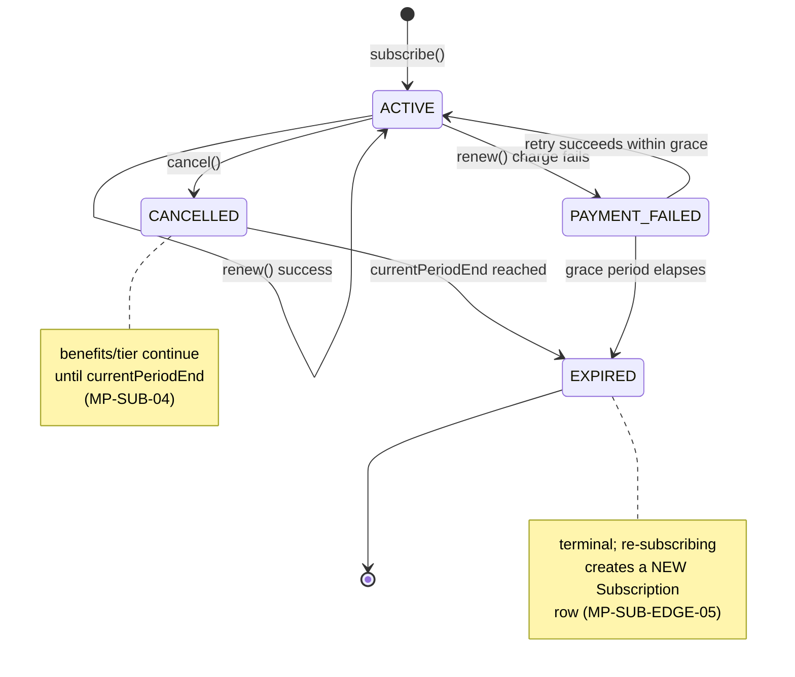
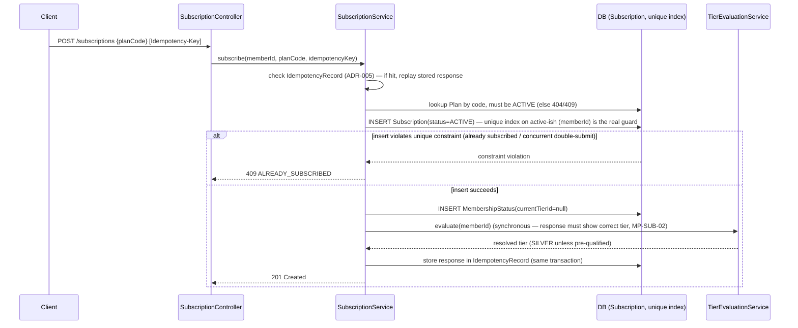
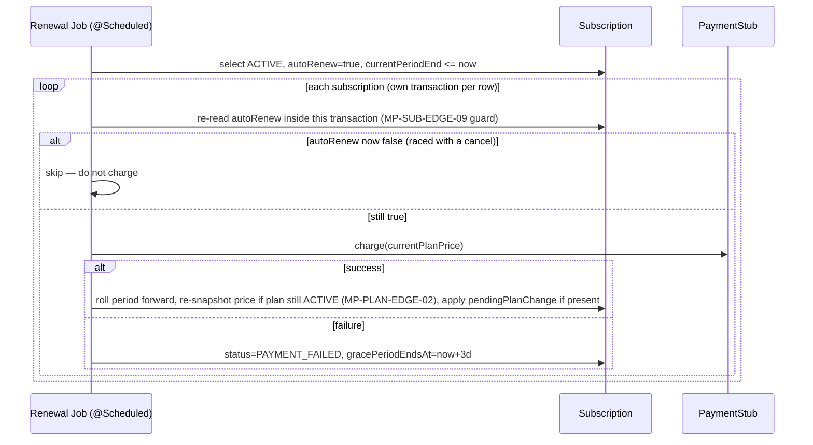

# LLD-04 — Subscription Lifecycle

Implements PRD `04-subscription-lifecycle.md` (`MP-SUB-*`). The tier-earned-vs-chosen decision
that shapes this entire document is recorded as **ADR-002** in `docs/hld/README.md` §6 — read that
first; this file assumes it as settled and focuses on implementation.

## 1. State Machine



**N3 cross-reference (second review pass)**: the `CANCELLED` note above ("benefits/tier continue
until `currentPeriodEnd`") is the exact rule the checkout layer's tier-resolution gate must
implement — see `07-checkout-integration.md` §2, which the second architect review found was, in
its first-pass wording, at risk of reading as a bare `status == ACTIVE` check that would have
silently contradicted this state diagram's own note. That gate now checks "is the membership still
within its paid period" (`ACTIVE`, or `CANCELLED`/`PAYMENT_FAILED` with the period/grace not yet
elapsed), not literal `status == ACTIVE`, so the two documents are consistent.

`CANCELLED → EXPIRED` and `PAYMENT_FAILED → EXPIRED` transitions are Increment-1/2 (driven by the
expiry sweep / renewal job, see §5). Day-1 ships `[*] → ACTIVE`, `ACTIVE → CANCELLED`, and the
`PATCH plan` mutation (which does not change `status`).

## 2. Subscribe (`MP-SUB-02`, Day-1)



Application-level "check then insert" is explicitly **not** relied upon for the double-subscribe
guarantee (PRD 08 §1's stated principle) — the partial unique index in LLD-01 §4 is the actual
arbiter; the service layer only translates the resulting DB exception into `409`. See
`06-concurrency-and-transactions.md` §2 for the full race analysis (MP-AC-028).

## 3. Plan Upgrade/Downgrade — Billing Cadence Change (`MP-SUB-03`, Day-1)

Tier is never touched by this flow (ADR-002). Deferred-to-boundary, no proration (MP-SUB-EDGE-02,
an explicit MVP simplification carried forward unchanged):

```
function switchPlan(memberId, newPlanCode):
    sub = loadActiveSubscription(memberId)  // else 404 SUBSCRIPTION_NOT_FOUND
    if sub.plan.code == newPlanCode: return 400 SAME_PLAN
    newPlan = loadPlan(newPlanCode)         // else 404 / 409 per MP-PLAN-04 rules
    sub.pendingPlanChangeJson = {planId: newPlan.id, effectiveAt: sub.currentPeriodEnd}
    save(sub)  // optimistic @Version guards concurrent admin/renewal writes to the same row
    return sub with pendingPlanChange in response
```
The actual `planId`/`priceAtSubscription` swap happens inside the renewal job (§5, Increment 2)
when `currentPeriodEnd` is reached and `pendingPlanChange` is non-null — this keeps "request a
switch" and "apply a switch" as two separate, independently testable operations.

## 4. Cancel (`MP-SUB-04`, Day-1)

```
function cancel(memberId):
    sub = loadSubscriptionAnyStatus(memberId)  // else 404 SUBSCRIPTION_NOT_FOUND (never subscribed)
    if sub.status == CANCELLED: return 200 (idempotent no-op, MP-SUB-04)
    if sub.status not in (ACTIVE, PAYMENT_FAILED): return 409  // e.g. already EXPIRED
    sub.status = CANCELLED
    sub.autoRenew = false
    save(sub)  // @Version-guarded
    return 200
```
No `Idempotency-Key` handling here (ADR-005) — cancel is idempotent by construction because the
operation is "set to a specific end state," not "append an effect"; calling it N times converges
to the same row state with no side-effect multiplication.

## 5. Renewal / Grace Period (`MP-SUB-06`, Increment 2)


`PaymentStub` (Increment 2): deterministic success by default, with a test-only forced-failure
toggle (`PaymentStub.forceFailureFor(memberId)`), per PRD 04 §7 — this is what makes
`PAYMENT_FAILED`/grace-period behavior demoable without a real gateway or waiting real days. A
`Clock` bean (not scattered `Instant.now()` calls) is injected everywhere period/grace-period math
happens, so tests can advance time deterministically (MP-NFR-06).

## 6. Expiry Sweep (Increment 2)

Same `@Scheduled` job family as the tier nightly batch (LLD-02 §3) or a dedicated one — either is
acceptable; this design recommends a **separate** `@Scheduled` method in the same
`ReconciliationScheduler` class (shared `Clock`, shared cron trigger config, distinct queries) so
tier-recompute and expiry-sweep failures are isolated from each other: `CANCELLED` with
`currentPeriodEnd` passed → `EXPIRED` + `MembershipExpiredEvent`; `PAYMENT_FAILED` with
`gracePeriodEndsAt` passed → `EXPIRED`.

## 7. Business Rules Carried Forward

MP-SUB-EDGE-04 (expiry during in-progress checkout) and MP-SUB-EDGE-03 (tier demotion doesn't
claw back in-flight benefits) both resolve via the snapshot-at-`startCheckout` rule — see
`07-checkout-integration.md` §3, not restated here (matching the PRD's own "state once, defer
everywhere else" documentation discipline, which the review specifically praised). MP-SUB-EDGE-05
(re-subscribe doesn't restore prior tier) is satisfied by construction: a fresh `Subscription` +
`MembershipStatus` row always starts with `currentTierId=null` and runs `evaluate()` from scratch.
MP-SUB-EDGE-06 (orders while not a member still count toward future re-subscribe tier criteria) is
satisfied by construction: `OrderHistoryReader` queries `Order` directly by `memberId` and window,
independent of subscription status — only the *evaluation trigger* (not the historical read) is
gated on `ACTIVE` status.
