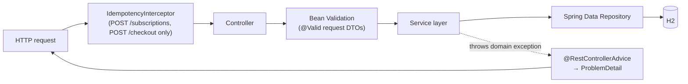

# LLD-05 — API Layer

Implements PRD `06-api-contracts.md` (`MP-API-*`). REST surface is unchanged from the PRD's shapes
except where noted (idempotency scoping per ADR-005, `422` dropped per Finding 8). Package:
`com.application.membershipmodule.*.web` (one controller package per module).

## 1. Layering



- **Controller**: thin — maps request DTO → service call → response DTO. No business logic, no
  direct repository access (testability, MP-NFR-06 — every rule in LLD-02/03/04 is triggerable via
  a direct service call in tests, bypassing MockMvc entirely).
- **Service**: owns transaction boundaries (`@Transactional` at the service-method level, per PRD
  08 §6) and business rules.
- **Repository**: `JpaRepository` interfaces, no business logic.
- **DTOs**: request/response records, separate from JPA entities (no entity leaking through the
  API — standard practice, also keeps `paramsJson`'s typed `BenefitConfig`/criterion records from
  needing to double as wire DTOs).

## 2. DTO Shapes (Day-1 subset; full set matches PRD 06 verbatim)

```java
// POST /api/v1/subscriptions
record SubscribeRequest(@NotBlank String planCode) {}
record SubscriptionResponse(String subscriptionId, String memberId, String planCode, String status,
    String currentTier, Instant currentPeriodStart, Instant currentPeriodEnd, boolean autoRenew,
    PendingPlanChangeDto pendingPlanChange /* nullable */) {}

// POST /api/v1/checkout
record StartCheckoutRequest(@NotEmpty @Valid List<OrderItemDto> items) {}
record OrderItemDto(@NotBlank String productId, @NotBlank String categoryCode,
    @NotNull @DecimalMin("0.01") BigDecimal unitPrice, @Min(1) int quantity) {}
record CheckoutStartedResponse(String orderId, String status, BigDecimal subtotal,
    BigDecimal estimatedDeliveryFee, BigDecimal estimatedDiscount, List<String> benefitsApplied) {}
```
`benefitsApplied` is rendered by mapping each `BenefitEffect` (LLD-03 §1) to its `source` string
(the shipped types' `BenefitType.name()`, or an arbitrary string for a future out-of-tree type) —
this is the one place the sealed `BenefitEffect` hierarchy is exhaustively `switch`ed over (LLD-03
§6's called-out exception to "pure addition"); the switch is over the closed **effect-shape**
sealed interface (`DeliveryFeeWaiver`/`LineItemDiscount`/`EntitlementFlag`), not over
`BenefitType`, so it does not need a case per benefit type, only per effect shape.

## 3. Validation

- **Field-level**: Jakarta Bean Validation annotations on request DTOs (`@NotBlank`,
  `@DecimalMin`, etc.) — caught by Spring's default `MethodArgumentNotValidException` handling,
  translated to `400` with `errors[]`.
- **Admin config schema validation** (Increment 1, `POST /admin/tiers/{code}/criteria` and
  `.../benefits`): for criteria, `paramsJson` is checked against `TierCriterionEvaluatorRegistry`
  (LLD-02 §1) — unknown `type` string → `400`. For benefits, `paramsJson` is parsed via
  `BenefitPolicyRegistry.find(benefitType).parseConfig(paramsJson)` (LLD-03 §1/§2, updated in the
  second review pass so each policy owns its own config parsing rather than a central sealed-type
  switch) — unknown `benefitType`, or a `parseConfig` that throws (missing required field, wrong
  type), both map to `400 INVALID_BENEFIT_PARAMS` before any write. Either way, admin-write
  validation reuses the **same registry** the runtime engine evaluates against — one source of
  truth, no drift risk between "what admin-write accepts" and "what evaluation understands," and
  this is the concrete mechanism behind PRD 03 §4 pt.3's "validated against a per-type schema at
  write time."
- **Business-rule validation** (e.g., plan not `ACTIVE`, duplicate active benefit): performed in
  the service layer, translated to `409`/`404` per the table below.

## 4. Error Format & Status Code Convention

RFC 7807 `ProblemDetail` (Spring MVC 6+ native), unchanged from PRD 06 §0, via a single
`@RestControllerAdvice`:

| Status | Meaning | Example `errorCode` |
|---|---|---|
| `400` | Field validation or admin-config schema failure | `INVALID_BENEFIT_PARAMS` |
| `404` | Referenced resource doesn't exist | `PLAN_NOT_FOUND`, `NO_SUBSCRIPTION` |
| `409` | Exists but conflicts with current state / concurrent-modification | `ALREADY_SUBSCRIBED`, `CONCURRENT_MODIFICATION`, `DUPLICATE_ACTIVE_BENEFIT` |
| `500` | Unexpected | — |

**`422` is dropped** (resolves Finding 8) — the PRD reserved it but never used it, and this design
introduces no case that needs it either; every "semantically invalid" case identified across the
PRD (unknown criterion type, jointly-nonsensical params) already maps cleanly to `400` (fails
validation before business rules) in this implementation, so carrying a reserved-but-dead status
code forward would just reproduce the same dead specification the review flagged.

## 5. Endpoint List (Day-1 vs. Increment)

| Endpoint | ID | Day-1 | Notes |
|---|---|---|---|
| `GET /api/v1/plans` | MP-API-01 | ✅ | |
| `GET /api/v1/tiers` | MP-API-02 | ✅ | |
| `POST /api/v1/subscriptions` | MP-API-03 | ✅ | idempotency-key enforced (ADR-005) |
| `PATCH /api/v1/subscriptions/me/plan` | MP-API-04 | ✅ | key header accepted, not wired to `IdempotencyRecord` — safe-by-construction (ADR-005) |
| `POST /api/v1/subscriptions/me/cancel` | MP-API-05 | ✅ | idempotent by construction, no key needed |
| `GET /api/v1/subscriptions/me` | MP-API-06 | ✅ | |
| `POST /api/v1/checkout` | MP-API-07 | ✅ | idempotency-key enforced (ADR-005) |
| `POST /api/v1/checkout/{orderId}/place` | MP-API-08 | ✅ | state-guarded, no key needed |
| `GET /api/v1/deals` | MP-API-09 | Increment 1 | needs `Deal` entity |
| `POST /api/v1/admin/plans` | MP-API-10 | Increment 1 | |
| `POST /api/v1/admin/plans/{code}/activate\|deprecate` | MP-API-11 | Increment 1 | |
| `POST /api/v1/admin/tiers/{code}/criteria` | MP-API-12 | Increment 1 | |
| `POST /api/v1/admin/tiers/{code}/benefits` | MP-API-13 | Increment 1 | |
| `DELETE /api/v1/admin/tiers/{code}/benefits/{id}` | MP-API-14 | Increment 1 | |
| `POST /api/v1/admin/members/{id}/cohort` | MP-API-15 | Increment 1 | needed once `COHORT_MEMBERSHIP` ships |

## 6. Headers (unchanged from PRD)

`X-Member-Id` / `X-Admin-Id` stand in for a resolved auth principal (no real authN/authZ, PRD
README §4 — unchanged, explicit non-goal). `Idempotency-Key` is optional; its enforcement is
scoped per ADR-005, not applied uniformly.
