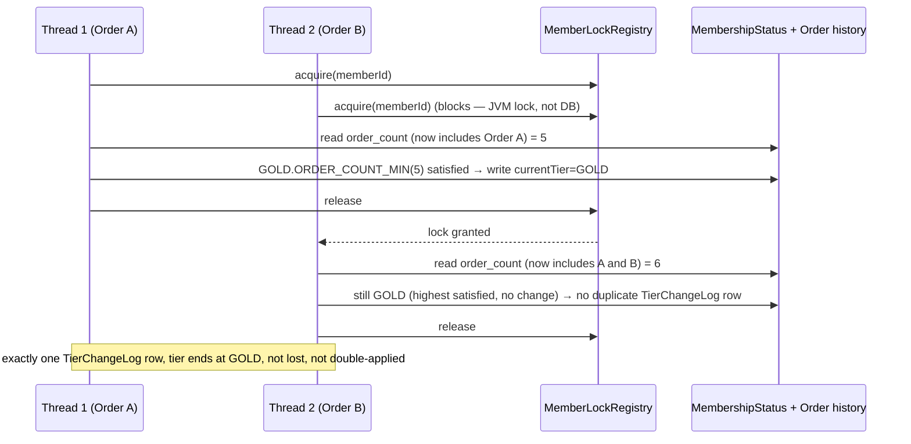

# LLD-06 — Concurrency and Transactions

Implements PRD `08-non-functional-and-concurrency.md` (`MP-NFR-*`). This is the direct resolution
of Review Findings 4 and 5 — see `docs/hld/README.md` ADR-003 and ADR-005 for the decision
records; this document is the implementation detail behind them.

## 1. The Tier-Recompute Chokepoint (MP-NFR-01, MP-TIER-EDGE-01, MP-AC-014/015)

### 1.1 The race, restated concretely
```
T1: read order_count = 4        T2: read order_count = 4
T1: (this order) count = 5      T2: (this order) count = 5
T1: 5 < GOLD threshold(5)? NO   T2: 5 < GOLD threshold(5)? NO
```
Naive concurrent evaluation both conclude "still Silver" even though the combined true count (6)
should trigger Gold — a lost-update/read-skew race.

### 1.2 Design: dual-layer, in-process lock is primary

> **N1 fix (second review pass)**: the first-pass sketch had `evaluate()` call
> `doEvaluateTransactional()` via a plain same-class (`this.`) invocation — a Spring AOP
> self-invocation bug that silently bypasses the proxy implementing `@Transactional`, so the
> "held for the duration of one evaluation" claim below was **not actually true as written**: each
> repository call inside the method ran in its own auto-committing mini-transaction, and the DB
> lock was released the instant the single call that acquired it returned. The `ReentrantLock`
> itself was unaffected (plain Java, not proxy-mediated), so the headline lost-update race was
> still prevented — but the defense-in-depth transactional atomicity was not real. Fixed by moving
> the `@Transactional` method to a **separate bean** that `TierEvaluationService` calls through
> (full detail and rationale in `02-tier-evaluation-engine.md` §2 — reproduced here since this file
> is where the locking claim is made and load-bearing):

```java
@Component
public class MemberLockRegistry {
    private final ConcurrentHashMap<UUID, ReentrantLock> locks = new ConcurrentHashMap<>();
    public LockGuard acquire(UUID memberId) {
        ReentrantLock lock = locks.computeIfAbsent(memberId, id -> new ReentrantLock());
        lock.lock();
        return () -> lock.unlock(); // AutoCloseable
    }
}

@Service
public class TierEvaluationService {
    private final MemberLockRegistry memberLockRegistry;
    private final TierEvaluationTransactionalOps txOps; // separate bean — NOT `this`

    UUID evaluate(UUID memberId) {
        try (var guard = memberLockRegistry.acquire(memberId)) {
            return txOps.evaluateAndPersist(memberId); // cross-bean call → goes through
                                                         // txOps's Spring proxy, so @Transactional
                                                         // is genuinely applied (fixes N1)
        }
    }
}

@Component
public class TierEvaluationTransactionalOps {
    @Transactional
    UUID evaluateAndPersist(UUID memberId) {
        MembershipStatus status = membershipStatusRepo.lockBySubscriptionId(subscriptionId); // PESSIMISTIC_WRITE, defense-in-depth
        // ... read order history fresh, evaluate, write, publish TierChangedEvent — all inside
        // this one real transaction now, so a mid-evaluation failure rolls back the whole write
    }
}
```
- **Primary guarantee**: the `ReentrantLock` acquired *before* `txOps.evaluateAndPersist` is called
  and held for its full duration (the `try`-with-resources scope in `evaluate`) serializes every
  call to `evaluate(memberId)` within this JVM. Because the stated deployment is a single instance
  (PRD 08 §1, unchanged), this is a complete, correct guarantee on its own — no JVM-internal race
  is possible while one thread holds the lock, full stop. This does not depend on any database
  behavior, and — after the N1 fix — does not depend on the transactional boundary being correct
  either; the two guarantees are now genuinely independent layers, not one silently-broken layer
  dressed up as two.
- **Secondary guarantee (defense-in-depth)**: `@Lock(LockModeType.PESSIMISTIC_WRITE)` on the
  `MembershipStatus` read inside `evaluateAndPersist`, unchanged from PRD 08 §2's mechanism, now
  genuinely held for the duration of the (real, proxy-backed) transaction rather than released
  after a single repository call. Retained for two reasons: (a) it is what becomes load-bearing if
  this system is ever scaled to multiple instances against Postgres, where DB-level row locks are
  the correct multi-instance mechanism and are well-established to block correctly (unlike the H2
  question below); (b) it guards against any *other* future code path that might write
  `MembershipStatus` without going through `TierEvaluationService.evaluate` (see LLD-01 §3's note
  on why `MembershipStatus.version` is also kept).

### 1.3 What is verified vs. assumed — the H2 spike (gating Day-1 task, per Finding 4)
The architect review's specific concern is that H2's `SELECT ... FOR UPDATE` blocking behavior
under the exact demo datasource config (`jdbc:h2:file:...;AUTO_SERVER=TRUE`) was never empirically
validated, and that a "Postgres-compatible schema" claim doesn't guarantee identical lock timing
semantics. **This design does not need that question answered to be correct**, because §1.2's
in-process lock is the primary guarantee and is not H2-dependent. It should still be answered, so
the defense-in-depth claim isn't itself an unverified assumption masquerading as a checked one.
Spike test, to run once against the real demo datasource before Increment 1 sign-off:

```java
@SpringBootTest
class MembershipStatusPessimisticLockSpikeTest {
    @Test
    void secondTransactionBlocksUntilFirstCommits() throws Exception {
        CountDownLatch t1HasLock = new CountDownLatch(1);
        CountDownLatch t1CanRelease = new CountDownLatch(1);
        AtomicLong t2AcquiredAt = new AtomicLong();
        long t1ReleasedAt;

        Thread t1 = new Thread(() -> transactionTemplate.execute(status -> {
            membershipStatusRepo.lockBySubscriptionId(subId); // PESSIMISTIC_WRITE
            t1HasLock.countDown();
            awaitUninterruptibly(t1CanRelease); // hold the lock open
            return null;
        }));
        t1.start();
        t1HasLock.await();

        Thread t2 = new Thread(() -> transactionTemplate.execute(status -> {
            membershipStatusRepo.lockBySubscriptionId(subId);
            t2AcquiredAt.set(System.nanoTime());
            return null;
        }));
        t2.start();
        Thread.sleep(300); // t2 should still be blocked
        t1ReleasedAt = System.nanoTime();
        t1CanRelease.countDown();
        t1.join(); t2.join();

        assertThat(t2AcquiredAt.get()).isGreaterThan(t1ReleasedAt); // t2 waited for t1
    }
}
```
**Recorded outcome, not asserted in advance**: run this once against the demo H2 config and record
the result in this document / the repo's test report. If H2 blocks as expected: the
defense-in-depth layer is confirmed genuinely load-bearing for a future multi-instance/Postgres
move. If H2 does **not** block reliably (e.g., because MVStore's lock timeout / retry behavior
differs from expectation): the design's correctness is unaffected (the in-process lock already
provides it) — the LLD is updated to state plainly "H2's `FOR UPDATE` is decorative for this demo;
the DB lock becomes genuinely enforcing only on Postgres," which is an honest, checked statement
instead of an unverified one. Either outcome is an acceptable resolution; an *unrecorded* outcome
is not — that was the actual gap the review flagged.

### 1.4 Multi-instance follow-on (documented limitation, unchanged in spirit from PRD 08 §1)
The `MemberLockRegistry` is JVM-local and does **not** generalize past one instance — this is a
named, explicit limitation, not a silent one. A multi-instance deployment would need to either (a)
rely solely on the DB pessimistic lock (verified per §1.3, correct on Postgres) and drop the
in-process layer, or (b) replace `MemberLockRegistry` with a distributed lock (e.g., a DB-backed
advisory lock or a coordination service). This is explicitly deferred, matching the PRD's own
existing single-instance caveat — not a new limitation introduced by this design.

### 1.5 Sequence — the headline race, resolved


## 2. Subscribe / Cancel Races (MP-NFR-02)

| Race | Guarantee | Mechanism |
|---|---|---|
| Double-subscribe (MP-SUB-EDGE-01, MP-AC-028) | Exactly one `Subscription` row created | DB partial unique index on `(memberId)` filtered to active-ish statuses — **not** application check-then-insert (PRD's explicitly stated principle, unchanged) |
| Cancel racing renewal (MP-SUB-EDGE-09, MP-AC-038) | Never charges a just-cancelled member | Renewal re-reads `autoRenew` inside its own transaction immediately before charging; `Subscription.version` optimistic lock catches any other concurrent write |
| Cancel racing cancel | Idempotent convergence, no error | `cancel()` sets to `CANCELLED` regardless of current value (once past the initial state check) — no key needed |

## 3. Idempotency (MP-NFR-03) — Scoped per ADR-005

### 3.1 Mechanism
```java
@Component
public class IdempotencyInterceptor implements HandlerInterceptor {
    // applied only to POST /api/v1/subscriptions and POST /api/v1/checkout (ADR-005)
    boolean preHandle(...) {
        String key = request.getHeader("Idempotency-Key");
        if (key == null) return true; // no key, no dedup — key is optional per PRD
        Optional<IdempotencyRecord> existing = repo.find(memberId, endpoint, key);
        if (existing.isPresent()) { replay(existing.get(), response); return false; }
        return true; // proceed; service layer writes the IdempotencyRecord in the same tx as the business write
    }
}
```
The `IdempotencyRecord` write happens **inside the same `@Transactional` service method** as the
business write (unique constraint on `(memberId, endpoint, idempotencyKey)`), so a concurrent
duplicate submission with the same key races on that DB constraint, not on application logic — the
loser's insert fails, and the service layer retries the *lookup* (not the operation) to return the
winner's stored response.

### 3.2 Test obligations (this is the concrete fix for Finding 5 — "claimed for 5, tested for 1")

| Endpoint | Mechanism | Required test |
|---|---|---|
| `POST /subscriptions` | `IdempotencyRecord` + DB unique index (both) | `MP-AC-029` (existing) |
| `POST /checkout` | `IdempotencyRecord` (sole guard — no DB constraint backstops duplicate `Order` rows) | **New**: retried `startCheckout` with the same key returns the identical `orderId`/response, no second `Order` row — this closes the exact gap the review named as the PRD's most glaring one |
| `PATCH .../plan` | Safe-by-construction (full-state overwrite, `@Version`-guarded) | **New, lightweight**: two identical `PATCH` calls in sequence produce the same `pendingPlanChange`, no error, no duplicate side effect — proves "safe by construction" is actually true, doesn't require `IdempotencyRecord` infrastructure |
| `POST .../cancel` | Safe-by-construction (idempotent state convergence) | `MP-AC-034` — **reclassified** (resolves Finding 13, see §3.3) |
| `POST .../place` | State-guarded (`WHERE status='CHECKOUT_STARTED'`) | `MP-AC-046` (existing) |

### 3.3 MP-AC-034 reclassification (resolves Finding 13)
`MP-AC-034` ("member calls cancel twice in a row") is a **sequential idempotency test**, not a
concurrency test — it proves calling cancel twice converges, not that two *simultaneous* cancel
requests are race-safe. This design keeps `MP-AC-034` labeled as what it actually is (idempotency)
and adds a genuinely concurrent variant alongside the `MP-AC-028` two-thread pattern: two threads
call `cancel()` for the same subscription at the same time; assert exactly one of them performs
the actual state transition write (the other observes `CANCELLED` already and short-circuits), no
exception surfaces to either caller, and the row ends in a consistent `CANCELLED` state with
`autoRenew=false`. Low severity (the underlying UPDATE is race-safe by construction regardless),
but now actually exercised, not merely asserted safe.

## 4. Checkout Atomicity (MP-NFR-04)

- Benefit snapshot is written **inside the same transaction** as `Order` creation at
  `startCheckout` — no window where a partial snapshot is visible to a concurrent `placeOrder` call
  (which cannot happen yet anyway, since the order doesn't exist until this transaction commits).
- `placeOrder`'s `CHECKOUT_STARTED → PLACED` transition is a single atomic
  `UPDATE ... WHERE status = 'CHECKOUT_STARTED'`; a double-submitted `placeOrder` for the same
  `orderId` has its second call affect zero rows, which the service layer translates to
  `409 ORDER_NOT_IN_CHECKOUT_STATE` (MP-AC-046) rather than double-emitting `OrderPlacedEvent`.

## 5. Transaction Boundaries Summary

| Operation | Boundary | Locks involved |
|---|---|---|
| `subscribe` | one `@Transactional` service method (insert `Subscription` + `MembershipStatus` + synchronous `evaluate` call, which nests its own lock/transaction) | DB unique index; `MemberLockRegistry` (via nested `evaluate`) |
| `switchPlan` / `cancel` | one `@Transactional` service method | `Subscription.version` optimistic |
| `evaluate` (tier recompute) | `MemberLockRegistry.acquire` (JVM) wraps one `@Transactional` method | `MemberLockRegistry` (primary), `MembershipStatus` PESSIMISTIC_WRITE (defense-in-depth) |
| `startCheckout` | one `@Transactional` service method (Order + OrderItems + snapshot) | none needed — new row, no contention |
| `placeOrder` | one `@Transactional` service method; event published `AFTER_COMMIT` | atomic status-guarded UPDATE |
| nightly reconciliation (Increment 1) | one transaction **per member** (not one giant transaction for the whole batch — keeps lock hold times short and isolates one member's failure from the rest) | `MemberLockRegistry` + `MembershipStatus` lock, per member, same as the event path |

## 6. Consistency Model (unchanged from PRD 08 §6)

READ COMMITTED isolation; strict consistency within a transaction; eventual consistency across the
`OrderPlacedEvent → tier recompute` pipeline, bounded by near-real-time for the event path and a
hard 24h ceiling via the nightly batch (Increment 1). No reliance on `SERIALIZABLE` isolation.
