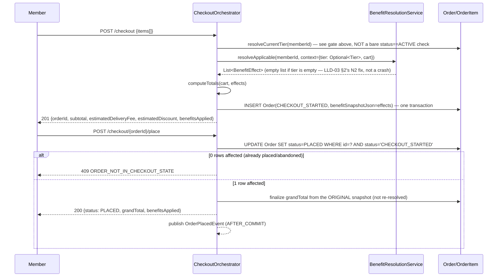

# LLD-07 — Checkout Integration

Implements PRD `05-checkout-integration.md` (`MP-CHK-*`). Simulated `Order`/`Checkout` domain, just
enough surface area to exercise the Benefit Policy Engine (LLD-03) end to end, per PRD's own
framing (this module does not own real commerce).

## 1. Domain (Day-1)

`Order` (`status`: `CHECKOUT_STARTED` → `PLACED`/`ABANDONED`), `OrderItem` — both per PRD 07 §3,
carried into LLD-01. No `BenefitSnapshot` entity (LLD-01 §3) — it lives as
`Order.benefitSnapshotJson`, a Jackson-serialized `List<BenefitEffect>` (LLD-03 §1).

## 2. Checkout Flow

> **N3 fix (second review pass)**: the first-pass sequence diagram annotated the tier-resolution
> step as "empty if no **ACTIVE** subscription," citing `MP-CHK-EDGE-03`. That cite is only correct
> for a true non-member (no subscription row at all); as worded, it reads as gating on
> `Subscription.status == ACTIVE` specifically, which would incorrectly zero out benefits for a
> `CANCELLED`-but-still-in-period member — directly contradicting `MP-SUB-04`/`MP-AC-032`, which
> require a cancelled member to retain full tier/benefits until `currentPeriodEnd`
> (`04-subscription-lifecycle.md` §1's state diagram note: "benefits/tier continue until
> `currentPeriodEnd`"). The gate below is restated precisely so a developer implementing this
> literally cannot plausibly reach for a bare `status == ACTIVE` check:

**Tier-resolution gate, stated explicitly** (`CheckoutOrchestrator.resolveCurrentTier(memberId)`):
```
resolveCurrentTier(memberId):
    sub = subscriptionRepository.findByMemberId(memberId)  // any status, or absent
    if sub is absent: return Optional.empty()               // true non-member — MP-CHK-EDGE-03
    if sub.status == EXPIRED: return Optional.empty()        // benefits ended — MP-AC-033
    if sub.status == PAYMENT_FAILED and gracePeriodEndsAt has passed: return Optional.empty()
    if sub.status == ACTIVE: return Optional.of(membershipStatus.currentTierId)
    if sub.status == CANCELLED and sub.currentPeriodEnd > now: return Optional.of(membershipStatus.currentTierId)
        // MP-SUB-04/MP-AC-032: cancelled-but-still-in-period retains full tier/benefits
    if sub.status == CANCELLED and sub.currentPeriodEnd <= now: return Optional.empty()
        // expiry sweep just hasn't run yet (Increment 2) — the period is over regardless
    if sub.status == PAYMENT_FAILED and still within grace: return Optional.of(membershipStatus.currentTierId)
        // MP-SUB-06: tier/benefits continue during grace
```
In words: benefits resolve normally whenever the membership is still **within its paid period** —
`ACTIVE`, or `CANCELLED`/`PAYMENT_FAILED` with `currentPeriodEnd` (or `gracePeriodEndsAt`) still in
the future — and resolve to empty only for "no subscription row," `EXPIRED`, or a `CANCELLED`/
`PAYMENT_FAILED` row whose period has actually elapsed. This is the single sentence the review
asked for, made literal and unambiguous rather than left as sequence-diagram shorthand.



Benefits are resolved **once**, at `startCheckout`, and never re-resolved at `placeOrder` — this
is MP-CHK-EDGE-01, the single most-referenced rule in the PRD (deferred to by MP-TIER-EDGE-03,
MP-BEN-EDGE-05, MP-SUB-EDGE-04), implemented here as: `placeOrder` reads
`Order.benefitSnapshotJson` and nothing else when computing `grandTotal` — it has no code path
that calls `BenefitResolutionService` a second time.

## 3. `computeTotals`

```
subtotal = sum(item.lineTotal for item in cart)
discountTotal = sum(effect.amount for effect in snapshot if effect is LineItemDiscount)
                // per-line capping/proportional-trim math already applied by
                // PercentageDiscountPolicy.apply (LLD-03 §4) — computeTotals just sums
deliveryFee = snapshot contains DeliveryFeeWaiver ? 0 : FLAT_DELIVERY_FEE (₹49 default, configurable)
grandTotal = subtotal - discountTotal + deliveryFee
```

## 4. Order-Placement / Tier-Recompute Decoupling (resolves Review Finding 3)

> **Superseded in part (2026-08-17)**: the code sketch and "no outbox, no broker" framing below
> describe the *original* ADR-004 decision. That direct-call design had a real, 100%-reproducible
> bug — a nested `@Transactional` call from inside `AFTER_COMMIT` couldn't bind a fresh transaction
> (`docs/reviews/04-e2e-prd-verification.md` FAIL #1) — fixed by routing through a Redis Stream
> instead. The decoupling *principle* below (never block/roll back order placement on a
> tier-recompute failure) is unchanged and still correctly describes the system's behavior; only
> the transport changed. See `docs/hld/README.md` ADR-004's addendum and
> `docs/lld/02-tier-evaluation-engine.md` §3.2 for the current design — this section is kept for
> historical context on *why* the decoupling exists, not as an accurate description of the current
> call path.

PRD `05` and `README` both referenced an unspecified "outbox/retry pattern" for a failed
tier-recompute after order placement. **This design drops that language entirely** (ADR-004,
`docs/hld/README.md` §6) and implements the decoupling with two ordinary Spring mechanisms:

```java
@TransactionalEventListener(phase = TransactionPhase.AFTER_COMMIT)
public void onOrderPlaced(OrderPlacedEvent event) {
    try {
        tierEvaluationService.evaluate(event.memberId());
    } catch (Exception e) {
        log.error("tier recompute failed for order {}, will self-heal via nightly batch", event.orderId(), e);
        // deliberately swallowed — order placement already committed and must not be affected
    }
}
```
- The listener only fires **after** the order-placement transaction commits (`AFTER_COMMIT`), so a
  tier-recompute failure can never roll back or block order placement (MP-CHK-04's actual
  requirement) — there is no shared transaction to roll back in the first place.
- A thrown exception inside the listener is caught, logged, and **not** rethrown — order placement
  has already succeeded and returned to the client by this point regardless.
- Recovery for a failed/missed recompute is the **nightly reconciliation batch** (LLD-02 §3,
  Increment 1) — the same mechanism PRD 02 §5 already specifies for time-based demotion, now doing
  double duty as the resilience story too, exactly as ADR-004 decided. No `Outbox` entity, no
  dispatcher, no retry/backoff policy — none of that is built, and none of it is silently implied
  by leftover PRD wording anymore.
- **N5 fix (second review pass) — the Day-1 gap this created, stated explicitly**: the nightly
  batch is Increment 1, not Day-1. On Day-1 specifically, a swallowed exception in this listener
  has **no automatic recovery** — the 24h bound below does not hold until Increment 1 ships. This
  is why LLD-02 §3's manual recompute trigger (`POST /internal/tier-recompute`) is pulled explicitly
  into the **Day-1** column (not "Day-1 demo convenience" buried under an Increment-1 heading, as
  the first pass had it) — see LLD-02 §3.1 for the full statement of Day-1's actual
  tier-consistency bound (session-scoped/best-effort, not yet 24h-guaranteed).
- **What "eventually reflected" means concretely for `MP-AC-047`**: on Day-1, "immediately via the
  manual-trigger endpoint" (LLD-02 §3) or not at all until someone calls it — there is no
  time-bounded automatic guarantee yet. From Increment 1 onward: within one nightly batch cycle
  (24h worst case) or immediately via the same manual-trigger endpoint — never "automatically
  retried within seconds," on any increment. This is stated explicitly so the gap the review
  flagged (a dangling promise the AC partially depended on) doesn't quietly reappear.

## 5. Business Rules Carried Forward (unchanged from PRD, for reference)

- **MP-CHK-EDGE-02** (abandoned checkout cleanup) — Increment 2, `@Scheduled` job marking
  `CHECKOUT_STARTED` rows `ABANDONED` after 24h; purely hygiene, no functional dependency.
- **MP-CHK-EDGE-03** (non-member checkout) — satisfied by construction: `resolveCurrentTier`
  (§2, N3 fix) returns `Optional.empty()` for a true non-member (no subscription row at all — not
  for a cancelled-but-in-period member, which is a materially different case handled by the same
  gate, see §2); `BenefitResolutionService.resolveApplicable` (LLD-03 §2, N2 fix) checks
  `context.tier().isEmpty()` explicitly and returns `List.of()` — no `NullPointerException`, no
  branch in `CheckoutOrchestrator` beyond the single `resolveCurrentTier` gate distinguishing
  member from non-member. MP-AC-045 (non-member checkout succeeds with empty `benefitsApplied`)
  is the direct test for this path; MP-AC-032 (cancelled-but-in-period member keeps full benefits)
  is the direct test that this gate does *not* also trigger the empty-tier path incorrectly.
- **MP-CHK-EDGE-04** (`>=` inclusive boundaries) — enforced consistently in
  `FreeDeliveryPolicy.isApplicable` and `OrderValueMinEvaluator.isSatisfied` (LLD-02 §1, LLD-03
  §1) — both use `>=`, no other comparator anywhere in either engine.
- **MP-CHK-EDGE-05** (proportional discount cap) — LLD-03 §4.
- **MP-CHK-EDGE-06** (unmapped category → `UNCATEGORIZED`) — `OrderItem.categoryCode` defaults to
  `UNCATEGORIZED` at ingestion if unmapped; category-filter matching in `PercentageDiscountPolicy`
  never matches `UNCATEGORIZED` unless the filter is literally `ALL` — flagged in LLD-03's
  Increment-1 test obligations alongside MP-BEN-EDGE-07 (Finding 9's "cheap, currently uncovered
  degrade-gracefully rules" list).
